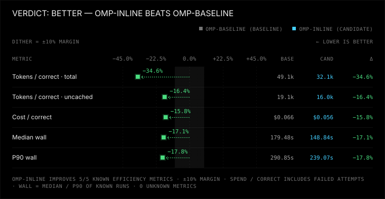
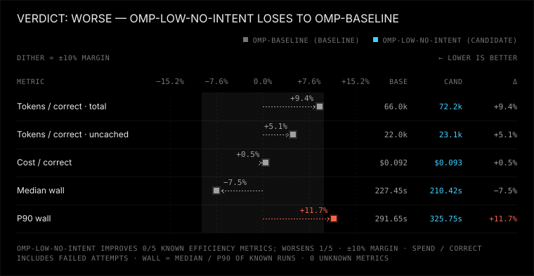

# Coding-agent harness benchmark

## What it measures

- **Correctness:** successful solutions, hidden-test coverage, regressions, and reliable completion.
- **Tokens:** total and uncached tokens per correct solution, including failed attempts, retries, and auxiliary calls.
- **Time/safety:** median and tail wall time, timeouts, prohibited edits, and post-edit verification.
- Correctness and safety use exact non-inferiority gates: a measured regression makes the candidate `worse`.
- Tokens and time use a 10% noise margin by default; gains without losses are `better`, mixed gains/losses are `tradeoff`, and no material change is `equivalent`.
- Mismatched tasks/inputs, fewer than three trials per task per arm, or unknown token/runtime data make the comparison `inconclusive`; unknown is not zero.
- See [BENCHMARK_ANALYSIS.md](BENCHMARK_ANALYSIS.md#automated-scoring) for the full rule and past findings.

## Published results

Each row compares a **baseline** arm with a **candidate** arm on the same tasks and model. The "Winner" column is the arm the rule favors, or states that there is none.

| Comparison (baseline → candidate) | Winner | By how much | Trust it? |
| --- | --- | --- | --- |
| **Where OMP puts tool descriptions:** native tool schemas (`omp-baseline`) → descriptions inlined in the system prompt (`omp-inline`). GPT-6.1 Sol high, isolated state, 6 tasks × 4 trials. [Report](published/omp-inline-descriptors-isolated-2026-09/REPORT.md) | **Inline descriptions** (`omp-inline`) | 35% fewer total tokens and 16% fewer uncached tokens per correct solution; median time 17% faster; 24/24 passed in both arms | Yes for efficiency. Correctness is at ceiling (both arms pass every run), so it cannot show a correctness difference. The "safer" part rests on one baseline run that skipped its final test |
| **Same question, early pilot:** 3 tasks × 1 trial. [Report](published/omp-inline-descriptors-pilot-2026-09/REPORT.md) | **None** (inconclusive) | Too few trials to decide | No: superseded by the row above; ran with the operator's personal OMP state |
| **Pi vs OMP**, both GPT-6.1 Sol high: `omp-sol` → `pi-sol`. 3 tasks × 3 trials. [Report](published/pi-vs-omp-sol-2026-09/REPORT.md) | **Pi** (`pi-sol`) | 56% fewer total tokens per correct solution; median time 12% faster; 9/9 passed in both arms | Partly: ran with the operator's personal state, and the two are different harnesses and versions |
| **OMP verbosity:** medium → low, intent tracing on. GPT-6.1 Sol high, isolated state, 4 hard tasks × 3 trials. [Graphs/report](published/omp-verbosity-intent-2026-09/low-verbosity/REPORT.md) | **Baseline** | Candidate uses 11.6% more uncached tokens per correct solution; 12/12 passed in each arm | Descriptive; four concurrent workers, cache/load uncontrolled; correctness at ceiling |
| **OMP tool-intent tracing:** on → off, medium verbosity. [Graphs/report](published/omp-verbosity-intent-2026-09/no-intent/REPORT.md) | **Baseline** | Candidate uses 12.5% more uncached tokens per correct solution; p90 time 11.8% higher | Same matched-model hard-task grid and parallel limitations |
| **OMP combined settings:** medium/on → low/off. [Graphs/report](published/omp-verbosity-intent-2026-09/low-no-intent/REPORT.md) | **Baseline** | Candidate p90 time 11.7% higher despite a lower median; token changes within the 10% band | Same grid; all 48 runs passed. [Overview and portable data](published/omp-verbosity-intent-2026-09/README.md) |





Every `REPORT.md` opens with the same kind of sentence, for example: *"Winner: omp-inline (candidate). Compared with omp-baseline (baseline) it uses fewer tokens, runs faster and is safer; correctness is the same."*

Re-score any bundle without model access: `python -m bench --results <bundle> compare --baseline <a> --candidate <b>`. Add charts to your own report with `compare --format markdown --charts-dir <dir>`; `export` includes them automatically.

## Requirements

- Python 3.12+; Python standard library only, no packages to install. CI covers 3.12 and 3.14 on Linux, Windows and macOS.
- Node 22+ for the supplied JavaScript tasks.
- The harness CLIs you want to test, installed and authenticated with **your own model account**. Real harness runs spend model usage; the reference run below does not.
- The Pi arms in `harnesses.toml` and `benchmark-pi-omp*.toml` expect a pinned local install: `npm install --prefix .tools/pi @earendil-works/pi-coding-agent@0.99.1`. The `herdr-omp` example expects `.tools/herdr/herdr.exe`. `.tools/` is gitignored.

Run commands from this repository's root. Workdirs are disposable copies, **not security sandboxes**: only run trusted tasks and harness commands. Configure approvals and any real sandbox in the harness itself.

## Quick start: zero model spend

```sh
python -m unittest discover -s tests
python -m bench.validate_tasks
python -m bench --config benchmark-reference.toml --results results/reference run --harness reference-a reference-b --trials 3 --jobs 12
python -m bench --results results/reference compare --baseline reference-a --candidate reference-b
```

The reference arms copy each task's `solution/` into the workdir. Expect **60 PASS runs** (ten tasks × two arms × three trials), then `Verdict: inconclusive` with the reason `token usage unknown`. This is intentional: `kind = "none"` has no model token data, so the run verifies the pipeline, not harness efficiency. Task validation checks failing starting repos and passing reference solutions without model calls.

Use a fresh results directory for each experiment: runs and invocation manifests are appended, not replaced.

## Compare two harness configurations

Define two named arms in a TOML config, each with `kind`, an argv-list `command`, and `version_command`; optional `env` supplies environment overrides. Start from [harnesses.toml](harnesses.toml), but pin **model/provider, thinking effort, tools, account/transport, and recovery/approval settings identically**. Change exactly one experimental variable.

Worked example: [benchmark-omp-descriptors.toml](benchmark-omp-descriptors.toml) defines `omp-baseline` and `omp-inline`. Their command templates differ only in the OMP `--config` overlay path:

- [experiments/omp-descriptors/baseline.yml](experiments/omp-descriptors/baseline.yml): `inlineToolDescriptors: "off"`.
- [experiments/omp-descriptors/inline.yml](experiments/omp-descriptors/inline.yml): `inlineToolDescriptors: "on"`.

The benchmark's global `--config` selects the TOML arm definitions; the OMP `--config` **inside each arm's argv** selects a run-local YAML overlay. An overlay alone does not isolate a run: OMP still reads the operator's `~/.omp/agent` (global `AGENTS.md`, settings, `models.yml`, MCP servers, memories). That is why both arms also set `state_template` and `env_commands`, described below.

New settings experiment: [benchmark-omp-verbosity-intent.toml](benchmark-omp-verbosity-intent.toml) compares the isolated baseline with low response verbosity, disabled tool-intent tracing, and both together. The [2x2 protocol and commands](experiments/omp-verbosity-intent/PLAN.md) pin four hard tasks × four arms × three trials (48 measured runs), with a separate preflight. The four-worker grid passed 48/48; the existing comparison rule favors baseline in all three comparisons. [Graphs, interpretation and portable data](published/omp-verbosity-intent-2026-09/README.md). Correctness remains at ceiling; parallel latency includes shared provider load.

### Isolating harness state

Without isolation, a result measures the harness **plus the operator's personal setup**. A canary check confirmed this for OMP: a non-isolated run quoted the operator's global `AGENTS.md` back, tried to connect to the operator's MCP servers, and sent about 970 more input tokens on its first request.

- `state_template = "experiments/omp-isolated/agent"` copies that checked-in directory into a fresh per-run state root. For omp and pi the root is set through `PI_CODING_AGENT_DIR`, for Claude through `CLAUDE_CONFIG_DIR`, and for Codex through `CODEX_HOME`. `OMP_PROFILE`/`PI_PROFILE` are removed so a profile cannot override it. The copy is deleted after the run.
- `env_commands = { OPENAI_CODEX_OAUTH_TOKEN = ["omp", "token", "openai-codex"] }` computes credentials per run from **your** login, so an isolated state root needs no stored credentials. Values are never written to records, manifests, artifacts or error messages.
- The template's files are recorded in `manifest.json` and shown in `REPORT.md`, so readers see the exact state the agent ran with. `context_hashes` fingerprint the files OMP actually reads.
- Each run also records `ancestor_context`: non-empty `AGENTS.md`, `.omp`, `.mcp.json` and similar entries in folders above the workdir, which harnesses discover as project context.
- `compare` warns when a stateful arm was not isolated or had ancestor context.

This command makes model calls; check your account and pinned model first:

```sh
python -m bench --config benchmark-omp-descriptors.toml --results results/descriptors run --harness omp-baseline omp-inline --trials 3 --jobs 12
```

Use **at least three trials per task per arm**. `--jobs` limits concurrent runs; the example uses 12 for throughput studies if your provider permits it. Baseline and candidate for each task/trial are submitted adjacently to help share conditions, not guarantee identical provider load. For latency-sensitive studies, instead use `--alternate-order --jobs 1` to run serial pairs with alternating arm order; parallel execution is not compatible with `--alternate-order`.

### Faster future experiments: screen, then confirm

Use one runner with `--jobs 8` (eight concurrent runs total, not eight per arm). It already isolates each workspace/state and writes one manifest/index; no manual worker merge is needed. Keep model, thinking effort, task IDs and concurrency identical across arms. This is a throughput schedule, not an isolated-latency comparison; do not use `--alternate-order`.

For four arms and four hard tasks, screen with one trial per cell (16 runs), then run a fresh confirmation grid with three trials (48 runs). Screening is exploratory: report every arm and do not lower `compare`'s three-trial minimum to announce a winner. Before confirmation, freeze the candidate set and acceptance criteria. If dropping candidates, include the baseline and disclose the screening selection; never pool screening rows with confirmation. New configurations still require a separate passing preflight with token metrics.

Runnable four-arm commands are in the [settings experiment's future workflow](experiments/omp-verbosity-intent/PLAN.md#future-eight-worker-workflow). Use fresh result roots for every experiment. If rate limits make eight workers unreliable, diagnose and choose a lower fixed concurrency for a new run rather than changing an active grid or selectively retrying cells. Eight workers reduce potential elapsed time, not the model usage of the same grid; actual speedup is unmeasured.


Command placeholders (from the `harnesses.toml` header):

```text
{prompt}, {workdir}, {session_dir}, {session_id}, {task_dir}, {run_id},
{benchmark_dir}, {python}, {timeout_sec}
```

These expand without a shell; runtime paths also work in `version_command`. Use `--task` to select task IDs and `--timeout` to override the per-task agent timeout.

### Four-arm OMP / Codex / Pi experiment

[benchmark-omp-inline-baseline-codex-pi.toml](benchmark-omp-inline-baseline-codex-pi.toml)
defines isolated `omp-inline`, `omp-baseline`, `codex` and `pi` arms using the same
ChatGPT account/backend, `gpt-6.1-sol` and high effort. Install local Codex with
`npm install --prefix .tools/codex @openai/codex@0.159.2` and Pi as above; authenticate
OMP to `openai-codex`. Pi/Codex receive temporary access-only credentials from
`omp token openai-codex`, never operator auth files or refresh tokens.

See [the preregistered protocol](experiments/omp-inline-codex-pi/PLAN.md) for the
four-run preflight, 72-run measured grid and three baseline comparisons. Windows
Codex workspaces inherit parent sandbox ACLs; credential state remains private.
Cross-harness results include native prompt/tool/sandbox differences, not just
OMP descriptor placement. [Published results and combined graph](published/omp-inline-baseline-codex-pi-2026-09/REPORT.md)
include sanitized per-run data; credentials and raw session artifacts are excluded.


## Read and share results

After the quick start, these examples use the reference arms. For a model experiment, substitute its results directory and arm names.

```sh
python -m bench --results results/reference compare --baseline reference-a --candidate reference-b
python -m bench --results results/reference compare --baseline reference-a --candidate reference-b --format markdown > REPORT.md
python -m bench --results results/reference export --baseline reference-a --candidate reference-b --out published/reference
```

Text is the default; `compare --format json` is also available (`--json` is a deprecated alias). `--margin` changes the efficiency noise band, and `--min-trials` changes the minimum evidence threshold.

`export` refuses an existing output directory. It produces a sanitized, shareable bundle:

- `REPORT.md`: verdict, dimension and per-task tables, setup, caveats, and reproduction commands.
- `runs.jsonl`: only the selected arms; workdirs cleared and artifact paths made bundle-relative.
- `manifest.json`: recorded provenance, when available.
- `SESSIONS.md`: task/trial-ordered links to captured sessions, with `--include-transcripts`.
- `runs/<harness>/<task>/trial-<n>/`: available `patch.diff`, `check.txt`, and `check-visible.txt` files.

Repository, home, and temporary paths are replaced with placeholders. **Transcripts are excluded by default**: they can contain your private system prompt/config. Add `--include-transcripts` after reviewing them to include `session.jsonl` alongside each trial's patch/check files, plus `stdout.jsonl` and `stderr.txt`. A session's companion files live in `session/`; multiple native session logs retain their names under `sessions/`. Path sanitization does not remove arbitrary secrets. Review patches and overlay contents for secrets too.

To compare sessions, open the same task/trial under each harness, e.g. `runs/pi-sol/debug-limiter/trial-1/session.jsonl` and `runs/omp-sol/debug-limiter/trial-1/session.jsonl`. These are the original harness session records, not a lossy reconstruction from stdout. The bundles under `published/` include them; no manual `/dump` or lookup by run UUID is needed.

`results/` is gitignored on purpose; `published/` is intended for reviewed bundles you choose to commit. Anyone can re-run `compare` directly on a bundle by setting the global `--results` to its exported directory; no original workdirs or model account are needed to inspect its verdict.

`run` automatically appends an invocation to `manifest.json` before scheduling runs. It records command templates, harness versions/config hashes, referenced repository overlay files, task hashes, trial/job settings, and platform/Python/Node versions. Keep this provenance with the run index.

## What a result can and cannot claim

- **Correctness ceiling:** if both arms pass every run, the warning says the tasks cannot distinguish correctness. Equal passing checks do not establish general reliability or comprehensive safety.
- **Inherited context:** use `state_template` (above) for every stateful arm. Otherwise `compare` warns `operator state not isolated`, and the result partly reflects the operator's personal instructions, settings and MCP servers. Isolation still leaves provider-side state (account, rate limits, server-side caching) and anything the harness reads outside its state root.
- **Cache and provider load are not controlled.** Concurrency, account limits, warm prefixes, and remote load can change token/time observations. Report conditions and repeat experiments rather than treating a small sample as universal superiority.
- Unknown regression/verification fields are reported as warnings, not filled with zero. Verification detection is a tool-sequence signal, not proof of all safety properties.

## Hard task tier

The original six tasks reached a correctness ceiling in published experiments. Four original `hard-*` tasks add algorithmic constraints, interacting defects, seeded differential checks, and regression traps. They are not copied LeetCode exercises: they test repository debugging and implementation as well as algorithms, without intentionally reusing public problem statements.

| Task | Challenge |
| --- | --- |
| `hard-segment-tree` | Compose lazy assignment/addition correctly; preserve logarithmic range queries and threshold search |
| `hard-expr-eval` | Repair precedence, chained comparisons, floored arithmetic, and positioned errors across parser modules |
| `hard-line-diff` | Produce minimal edits, unified hunks, and applicable patches; avoid quadratic work on sparse large diffs |
| `hard-dep-resolver` | Resolve version constraints with deterministic backtracking, rollback, and legal dependency cycles |

All four carry `tags = ["hard"]` and a 30-minute agent timeout. Tags are metadata, not a CLI filter; select task IDs explicitly. `run` without `--task` now includes all ten tasks. Existing task files and published bundles are unchanged; pin the original six IDs when reproducing an older experiment.

Run just the hard tier without model calls:

```sh
python -m bench --config benchmark-reference.toml --results results/hard-reference run --harness reference-a reference-b --task hard-segment-tree hard-expr-eval hard-line-diff hard-dep-resolver --trials 3 --jobs 12
```

For an actual harness comparison, use your matched-model config and arm names with the same explicit task list. Those runs spend model usage. Use serial alternating pairs for latency comparisons.

Calibration established that every starting repo fails and every reference passes. Visible-only bug fixes still fail hidden checks; naive alternatives fail performance guards. Seeded solution suites passed three repeated runs, and the full ten-task reference pipeline passed 60/60 runs at `--jobs 12`. Performance limits allow substantial local reference headroom but remain machine-dependent. **Model difficulty is not yet measured**: paid trials must establish whether these tasks reduce the correctness ceiling. Original tasks do not guarantee absence from future model training.

## Adding a task

Create a directory under `tasks/` with this layout:

```text
tasks/<id>/
  task.toml       # id, title, category, timeout_sec, check argv list
  prompt.md       # task given to the agent
  repo/          # starting source and visible tests
  hidden_tests/  # behavioral tests added only for grading
  solution/      # reference files overlaid on repo/
```

Rules:

- Hidden tests must check only behavior stated in the prompt or source documentation; do not demand undisclosed features.
- Include regression traps that already pass on the starting repo, alongside tests for the requested change. The starting repo must fail overall; the reference solution must pass visible and hidden checks.
- Keep tests deterministic, self-contained, and bounded; avoid live services, model calls, or network dependencies.
- Give tests unique **top-level** names so TAP-based regression attribution is unambiguous.

Then validate all tasks without agents:

```sh
python -m bench.validate_tasks
```

Current tasks:

| Task ID | Category | Title |
| --- | --- | --- |
| `bugfix-duration` | bugfix | Parse complete compound durations |
| `bugfix-invoice` | bugfix | Repair cent rounding and ordered invoice discounts |
| `debug-cache-race` | debug | Diagnose stale writes and poisoned cache flights |
| `debug-limiter` | debug | Diagnose hanging asynchronous limiter tests |
| `feature-csv-stream` | feature | Implement an incremental CSV parser |
| `feature-lru` | feature | Implement a bounded least-recently-used cache |
| `hard-segment-tree` | debug | Repair lazy range updates in a segment tree |
| `hard-expr-eval` | bugfix | Fix Python-compatible arithmetic in a multi-module evaluator |
| `hard-line-diff` | feature | Implement minimal line diff with unified hunks and patching |
| `hard-dep-resolver` | debug | Diagnose missed solutions in a dependency resolver |

## Adding a harness

Add an arm under `[harnesses.<name>]` in your TOML config. `command` and `version_command` are argument lists, not shell strings. Pass the task using `{prompt}` and direct session output to `{session_dir}` where the CLI supports it; see the existing templates before choosing flags.

Every kind receives benchmark wall time, exit/timeout tracking, visible/hidden grading, regression checks, and prohibited-edit detection. Session adapters in [bench/sessions.py](bench/sessions.py) supply these additional metrics when their source records exist:

| Kind | Session metrics |
| --- | --- |
| `omp` | Input/output/cache tokens, cost, requests/tool counts, compactions, model time, subagent and auxiliary usage, edit/verification signals; completion/retries for direct `--mode json` commands. |
| `pi` | Input/output/cache tokens, cost, requests/tool counts, compactions, auxiliary usage, edit/verification signals, stream completion/retries; no model-time telemetry. |
| `claude` | Input/output/cache tokens, tool/request counts, compactions and subagent count from sessions; cost/API time and final result from stdout. Auxiliary and edit/verification signals are unknown. |
| `codex` | Input/output/cached tokens, approximate turn counts, tool counts, compactions and final message from sessions. Cost, model time, auxiliary usage and edit/verification signals are unknown. |
| `none` | No session/model metrics; useful for deterministic pipeline checks. |

Missing metrics remain unknown. Ensure the CLI emits the expected records and that sessions can be attributed to the run; do not mistake a missing usage stream for a free or zero-token solution.
