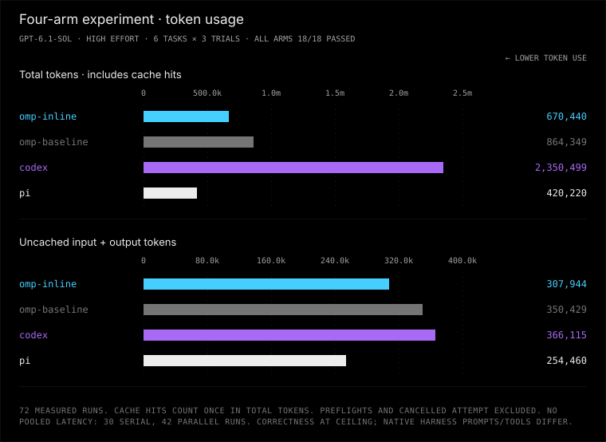

# OMP-inline vs OMP-baseline vs Codex vs Pi

72 measured runs: six tasks × three trials × four arms. All four arms passed
18/18 using `gpt-6.1-sol`, high effort and the same ChatGPT account/backend.
Native harness prompts, tools and sandbox policies differ.



## Results

- [Full report and interpretation](REPORT.md)
- [Combined graph (SVG)](combined.svg)
- [All 72 measured runs (sanitized CSV)](runs.csv)
- [Experiment configuration](../../benchmark-omp-inline-baseline-codex-pi.toml)
- [Protocol and rerun commands](../../experiments/omp-inline-codex-pi/PLAN.md)
- [Installation and authentication instructions](../../README.md#four-arm-omp--codex--pi-experiment)

The original study completed 30 runs serially, then 42 with four concurrent
workers at the user's request. The CSV records each run's phase; do not pool
serial and parallel latency. Preflights and one cancelled partial attempt are
excluded from measured totals. Empty metric cells mean unknown, not zero.

## Where are the session files?

**Raw session transcripts are not included in this published bundle.** They
remain in the experiment operator's local, gitignored `results/` directory;
a GitHub clone contains the sanitized CSV, not those transcripts.

From the repository root, the original session locations are:

```text
results/omp-inline-codex-pi/<run-id>/sessions/*.jsonl
results/omp-inline-codex-pi/parallel/<arm>/<run-id>/sessions/*.jsonl
```

All 72 completed measured runs have a retained JSONL session, 18 per arm.
The local `results/omp-inline-codex-pi/runs.jsonl` and each artifact's `run.json`
map the arm, task and trial to its `artifact_dir`. For Codex, use the captured
JSONL in that artifact's `sessions/` directory, not the temporary `CODEX_HOME`
path recorded in collection metadata: the temporary state was deleted.

Raw transcripts can contain local paths, command output and other private
context; they were not committed or pushed. Sharing them requires a separate
sanitization review. Authentication files, credentials and account identifiers
are not part of this publication.

## Try it again

Follow the linked setup instructions and use your own authenticated account.
For a fresh four-worker throughput run, execute from the repository root:

```sh
python -m bench --config benchmark-omp-inline-baseline-codex-pi.toml --results results/omp-inline-codex-pi-rerun run --harness omp-inline omp-baseline codex pi --trials 3 --jobs 4
python -m bench --results results/omp-inline-codex-pi-rerun report
```

These commands make real model calls. Use a new results directory for each
experiment. A consistent four-worker rerun has a different execution schedule
from this mixed-phase study; do not pool their latency. Use
`--jobs 1 --alternate-order` throughout instead for a serial latency study.
Only run trusted tasks: disposable workspaces are not security sandboxes.
