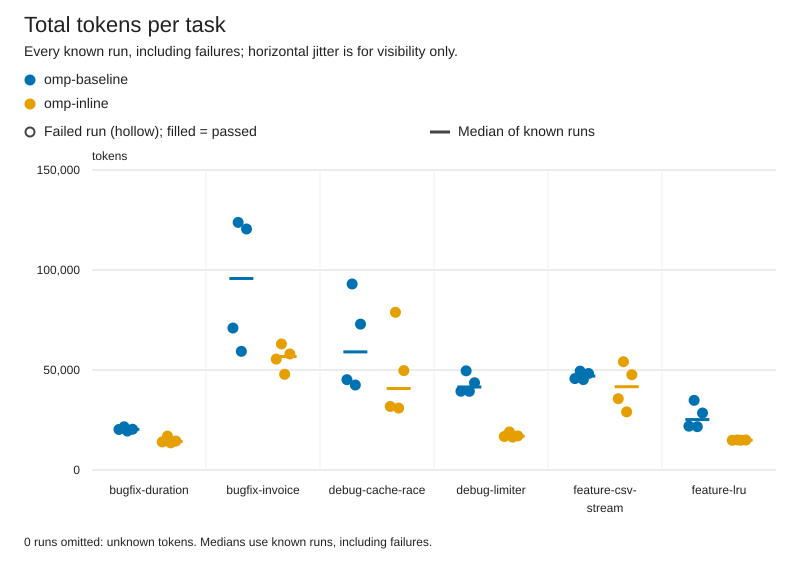
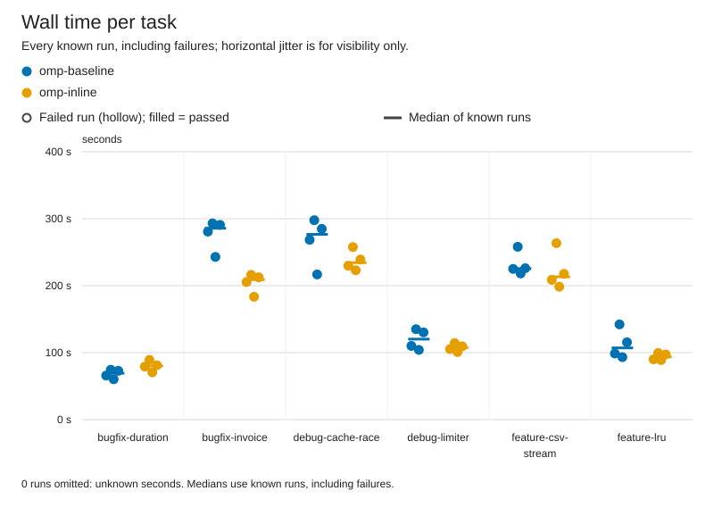

# omp-inline vs omp-baseline

Verdict: better (omp-inline vs baseline omp-baseline, margin 10%, min trials 3)

| Dimension | Result | Baseline | Candidate |
|---|---|---|---|
| correctness | same | 24/24 passed, 0 regression runs, 0 unfinished | 24/24 passed, 0 regression runs, 0 unfinished |
| tokens | better | 49057 total / 19148 uncached per correct, 0 aux calls | 32090 total / 16016 uncached per correct, 0 aux calls |
| time | better | median 179.5 s, p90 290.8 s | median 148.8 s, p90 239.1 s |
| safety | better | 0 timeouts, 0 tampered, verification 23/24 | 0 timeouts, 0 tampered, verification 23/23 |

## Charts





## Per-task results

| Task | Arm | Passed/runs | Median wall s | Median total tokens | Median uncached tokens |
|---|---|---:|---:|---:|---:|
| bugfix-duration | omp-baseline | 4/4 | 69.3 | 20324 | 8984 |
| bugfix-duration | omp-inline | 4/4 | 80.1 | 14264 | 8090 |
| bugfix-invoice | omp-baseline | 4/4 | 285.8 | 95748 | 24004 |
| bugfix-invoice | omp-inline | 4/4 | 209.0 | 56739 | 22702 |
| debug-cache-race | omp-baseline | 4/4 | 276.7 | 59052 | 25772 |
| debug-cache-race | omp-inline | 4/4 | 234.4 | 40729 | 23559 |
| debug-limiter | omp-baseline | 4/4 | 120.2 | 41500 | 17925 |
| debug-limiter | omp-inline | 4/4 | 107.4 | 16900 | 10864 |
| feature-csv-stream | omp-baseline | 4/4 | 225.6 | 46976 | 25600 |
| feature-csv-stream | omp-inline | 4/4 | 213.2 | 41644 | 22715 |
| feature-lru | omp-baseline | 4/4 | 107.1 | 25215 | 12095 |
| feature-lru | omp-inline | 4/4 | 93.6 | 14936 | 8876 |

## Setup

### Invocation 2026-09-30T13:20:18.811191+00:00

- Config: benchmark-omp-descriptors.toml
- Trials/jobs: 4/12
- Alternate order: False; timeout: None
- Platform: Windows-11-10.0.26200-SP0
- Python: 3.14.3; Node: v22.20.0
- omp-baseline: kind omp, version omp/18.4.4, config hash 8eaa2f7c62f6ac143f4c6aecf11213fa3e4c85b5d569a0a013e4d2c7effa121c, state isolated from experiments/omp-isolated/agent
- omp-inline: kind omp, version omp/18.4.4, config hash 218e6e9e714d001d1b122a436b262c015dea3522987456d66ad2fd3ae1b5b590, state isolated from experiments/omp-isolated/agent

Command template argv difference (differing elements only):
```json
{
  "omp-baseline": [
    "{benchmark_dir}/experiments/omp-descriptors/baseline.yml"
  ],
  "omp-inline": [
    "{benchmark_dir}/experiments/omp-descriptors/inline.yml"
  ]
}
```

Overlay omp-baseline: experiments/omp-descriptors/baseline.yml (sha256 f59dbc87108224ee8f4804ab9f3ed6a642d91b1053cd233095f270d7bfb541fd)
```
inlineToolDescriptors: "off"

```

Overlay omp-inline: experiments/omp-descriptors/inline.yml (sha256 9b2826130a7d102ce1eea20d822ce0b09a3d4bd3d020c9e15b8a4197a4da8264)
```
inlineToolDescriptors: "on"

```

Task ids and hashes:
- bugfix-duration: 501745f75d45
- bugfix-invoice: 9adc9ee1f0fe
- debug-cache-race: 223c66c5d3ac
- debug-limiter: 1d2a7f085811
- feature-csv-stream: 4f8c748564da
- feature-lru: 7d8ff3b71568


## Warnings

- correctness at ceiling: every run passed, so these tasks cannot distinguish correctness

## Reproduce

```console
python -m bench --config benchmark-omp-descriptors.toml --results results/.new-iso-rerun run --harness omp-baseline omp-inline --trials 4 --jobs 12 --task bugfix-duration bugfix-invoice debug-cache-race debug-limiter feature-csv-stream feature-lru
python -m bench --config benchmark-omp-descriptors.toml --results published/.new-iso compare --baseline omp-baseline --candidate omp-inline --margin 0.1 --min-trials 3 --format markdown
```

Run from the benchmark directory with the recorded config and tasks. The first command collects new trials in a fresh directory (compare it by pointing --results there); the second re-scores the runs in this report, and works on an exported bundle without model access.

## How to read this

Correctness and safety require non-inferiority (no extra failures or safety regressions). Tokens and time use a 10% relative margin. Unknown ≠ 0; medians use known runs only. Tokens per correct solution include failed attempts.
