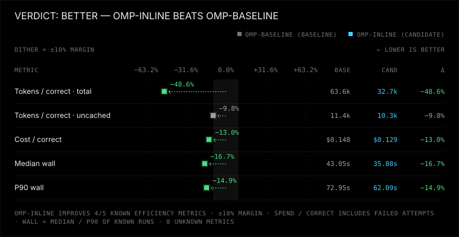
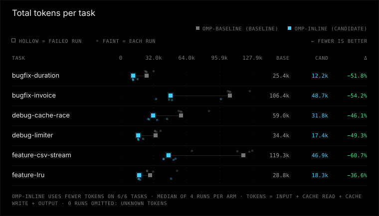
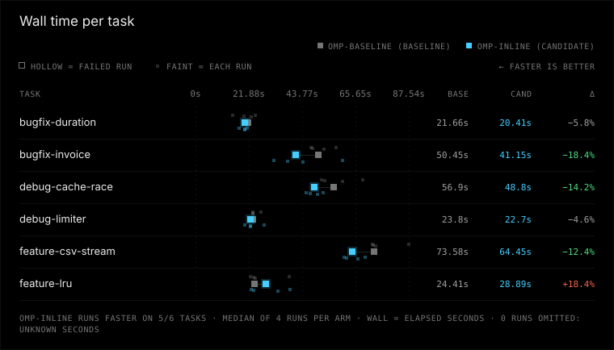

# omp-inline vs omp-baseline

Verdict: better (omp-inline vs baseline omp-baseline, margin 10%, min trials 3)

**Winner: omp-inline (candidate). Compared with omp-baseline (baseline) it uses fewer tokens and runs faster; correctness and safety are the same.**

| Dimension | omp-inline vs omp-baseline | omp-baseline (baseline) | omp-inline (candidate) |
|---|---|---|---|
| correctness | same | 24/24 passed, 0 regression runs, 0 unfinished | 24/24 passed, 0 regression runs, 0 unfinished |
| tokens | better | 63622 total / 11404 uncached per correct, 0 aux calls | 32711 total / 10292 uncached per correct, 0 aux calls |
| time | better | median 43.1 s, p90 73.0 s | median 35.9 s, p90 62.1 s |
| safety | same | 0 timeouts, 0 tampered, verification 24/24 | 0 timeouts, 0 tampered, verification 13/13 |

## Charts





## Per-task results

| Task | Arm | Passed/runs | Median wall s | Median total tokens | Median uncached tokens |
|---|---|---:|---:|---:|---:|
| bugfix-duration | omp-baseline | 4/4 | 21.7 | 25384 | 4784 |
| bugfix-duration | omp-inline | 4/4 | 20.4 | 12242 | 4357 |
| bugfix-invoice | omp-baseline | 4/4 | 50.4 | 106444 | 18488 |
| bugfix-invoice | omp-inline | 4/4 | 41.1 | 48714 | 16590 |
| debug-cache-race | omp-baseline | 4/4 | 56.9 | 58960 | 13172 |
| debug-cache-race | omp-inline | 4/4 | 48.8 | 31764 | 11706 |
| debug-limiter | omp-baseline | 4/4 | 23.8 | 34364 | 5502 |
| debug-limiter | omp-inline | 4/4 | 22.7 | 17419 | 5178 |
| feature-csv-stream | omp-baseline | 4/4 | 73.6 | 119300 | 19855 |
| feature-csv-stream | omp-inline | 4/4 | 64.4 | 46904 | 15896 |
| feature-lru | omp-baseline | 4/4 | 24.4 | 28802 | 5270 |
| feature-lru | omp-inline | 4/4 | 28.9 | 18270 | 5532 |

## Setup

### Invocation 2026-10-01T06:08:30.334027+00:00

- Config: benchmark-omp-descriptors-opus.toml
- Trials/jobs: 4/12
- Alternate order: False; timeout: None
- Platform: Windows-11-10.0.26200-SP0
- Python: 3.14.3; Node: v22.20.0
- omp-baseline: kind omp, version omp/18.4.6, config hash dc74a41ef9ffdaf69634f60dd5cbaa2338c5a2c8bcfa1f7e3186ad7538caba82, state isolated from experiments/omp-isolated/agent
- omp-inline: kind omp, version omp/18.4.6, config hash b8c262832816126f8ba71b468c39878230459cc3f4fd164820ff4d24deaa1210, state isolated from experiments/omp-isolated/agent

Command template argv difference (differing elements only):
```json
{
  "omp-baseline": [
    "{benchmark_dir}/experiments/omp-descriptors/baseline.yml"
  ],
  "omp-inline": [
    "{benchmark_dir}/experiments/omp-descriptors/inline.yml"
  ]
}
```

Overlay omp-baseline: experiments/omp-descriptors/baseline.yml (sha256 f59dbc87108224ee8f4804ab9f3ed6a642d91b1053cd233095f270d7bfb541fd)
```
inlineToolDescriptors: "off"

```

Overlay omp-inline: experiments/omp-descriptors/inline.yml (sha256 9b2826130a7d102ce1eea20d822ce0b09a3d4bd3d020c9e15b8a4197a4da8264)
```
inlineToolDescriptors: "on"

```

Task ids and hashes:
- bugfix-duration: 501745f75d45
- bugfix-invoice: 9adc9ee1f0fe
- debug-cache-race: 223c66c5d3ac
- debug-limiter: 1d2a7f085811
- feature-csv-stream: 4f8c748564da
- feature-lru: 7d8ff3b71568


## Warnings

- correctness at ceiling: every run passed, so these tasks cannot distinguish correctness

## Reproduce

```console
python -m bench --config benchmark-omp-descriptors-opus.toml --results results/omp-inline-descriptors-opus-2026-10-rerun run --harness omp-baseline omp-inline --trials 4 --jobs 12 --task bugfix-duration bugfix-invoice debug-cache-race debug-limiter feature-csv-stream feature-lru
python -m bench --config benchmark-omp-descriptors-opus.toml --results published/omp-inline-descriptors-opus-2026-10 compare --baseline omp-baseline --candidate omp-inline --margin 0.1 --min-trials 3 --format markdown
```

Run from the benchmark directory with the recorded config and tasks. The first command collects new trials in a fresh directory (compare it by pointing --results there); the second re-scores the runs in this report, and works on an exported bundle without model access.

## How to read this

Correctness and safety require non-inferiority (no extra failures or safety regressions). Tokens and time use a 10% relative margin. Unknown ≠ 0; medians use known runs only. Tokens per correct solution include failed attempts.
