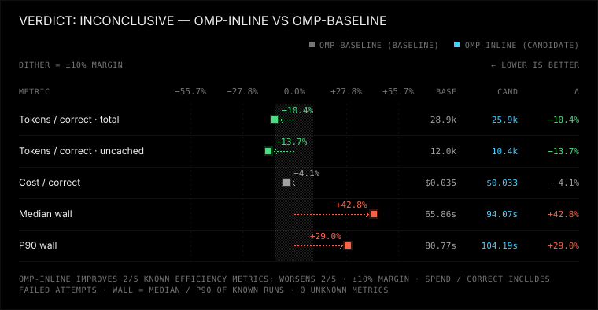
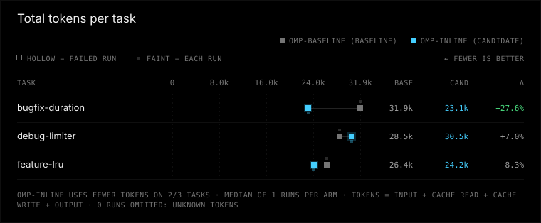
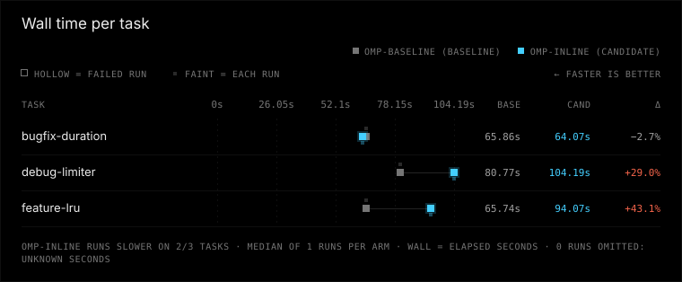

# omp-inline vs omp-baseline

Verdict: inconclusive (omp-inline vs baseline omp-baseline, margin 10%, min trials 3)

| Dimension | Result | Baseline | Candidate |
|---|---|---|---|
| correctness | same | 3/3 passed, 0 regression runs, 0 unfinished | 3/3 passed, 0 regression runs, 0 unfinished |
| tokens | better | 28938 total / 12000 uncached per correct, 0 aux calls | 25933 total / 10360 uncached per correct, 0 aux calls |
| time | worse | median 65.9 s, p90 80.8 s | median 94.1 s, p90 104.2 s |
| safety | same | 0 timeouts, 0 tampered, verification 0/0 | 0 timeouts, 0 tampered, verification 0/0 |

## Charts





## Per-task results

| Task | Arm | Passed/runs | Median wall s | Median total tokens | Median uncached tokens |
|---|---|---:|---:|---:|---:|
| bugfix-duration | omp-baseline | 1/1 | 65.9 | 31943 | 13767 |
| bugfix-duration | omp-inline | 1/1 | 64.1 | 23128 | 6744 |
| debug-limiter | omp-baseline | 1/1 | 80.8 | 28497 | 9041 |
| debug-limiter | omp-inline | 1/1 | 104.2 | 30495 | 13343 |
| feature-lru | omp-baseline | 1/1 | 65.7 | 26375 | 13191 |
| feature-lru | omp-inline | 1/1 | 94.1 | 24177 | 10993 |

## Setup

No manifest.json; setup not recorded.

## Reasons

- omp-baseline/bugfix-duration: 1 trials < 3
- omp-baseline/debug-limiter: 1 trials < 3
- omp-baseline/feature-lru: 1 trials < 3
- omp-inline/bugfix-duration: 1 trials < 3
- omp-inline/debug-limiter: 1 trials < 3
- omp-inline/feature-lru: 1 trials < 3

## Warnings

- operator state not isolated for 6 runs: the harness may have read the operator's personal instructions, settings and MCP servers
- correctness at ceiling: every run passed, so these tasks cannot distinguish correctness
- regression data unknown for 6 runs; regression comparison skipped
- verification unknown; verification comparison skipped

## Reproduce

config path not recorded; replace CONFIG with the harness configuration.
```console
python -m bench --config CONFIG --results results/omp-inline-descriptors-pilot-2026-09-rerun run --harness omp-baseline omp-inline --trials 3 --jobs 1
python -m bench --config CONFIG --results published/omp-inline-descriptors-pilot-2026-09 compare --baseline omp-baseline --candidate omp-inline --margin 0.1 --min-trials 3 --format markdown
```

Run from the benchmark directory with the recorded config and tasks. The first command collects new trials in a fresh directory (compare it by pointing --results there); the second re-scores the runs in this report, and works on an exported bundle without model access.

## How to read this

Correctness and safety require non-inferiority (no extra failures or safety regressions). Tokens and time use a 10% relative margin. Unknown ≠ 0; medians use known runs only. Tokens per correct solution include failed attempts.
