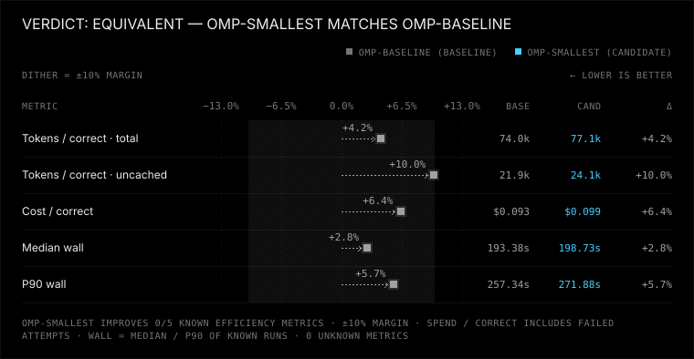
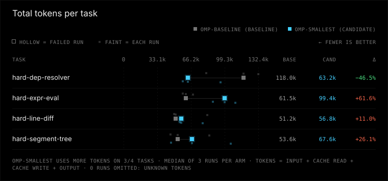
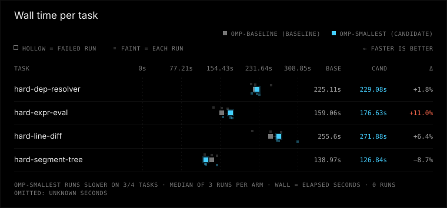

# omp-smallest vs omp-baseline

Verdict: equivalent (omp-smallest vs baseline omp-baseline, margin 10%, min trials 3)

**No winner: omp-smallest (candidate) and omp-baseline (baseline) are equivalent within the 10% margin.**

| Dimension | omp-smallest vs omp-baseline | omp-baseline (baseline) | omp-smallest (candidate) |
|---|---|---|---|
| correctness | same | 12/12 passed, 0 regression runs, 0 unfinished | 12/12 passed, 0 regression runs, 0 unfinished |
| tokens | same | 73975 total / 21879 uncached per correct, 0 aux calls | 77115 total / 24059 uncached per correct, 0 aux calls |
| time | same | median 193.4 s, p90 257.3 s | median 198.7 s, p90 271.9 s |
| safety | same | 0 timeouts, 0 tampered, verification 12/12 | 0 timeouts, 0 tampered, verification 12/12 |

## Charts





## Per-task results

| Task | Arm | Passed/runs | Median wall s | Median total tokens | Median uncached tokens |
|---|---|---:|---:|---:|---:|
| hard-dep-resolver | omp-baseline | 3/3 | 225.1 | 117995 | 26081 |
| hard-dep-resolver | omp-smallest | 3/3 | 229.1 | 63182 | 28236 |
| hard-expr-eval | omp-baseline | 3/3 | 159.1 | 61535 | 22751 |
| hard-expr-eval | omp-smallest | 3/3 | 176.6 | 99416 | 20696 |
| hard-line-diff | omp-baseline | 3/3 | 255.6 | 51178 | 20970 |
| hard-line-diff | omp-smallest | 3/3 | 271.9 | 56797 | 33373 |
| hard-segment-tree | omp-baseline | 3/3 | 139.0 | 53625 | 20857 |
| hard-segment-tree | omp-smallest | 3/3 | 126.8 | 67634 | 16843 |

## Setup

### Invocation 2026-09-30T21:31:48.620840+00:00

- Config: benchmark-omp-smallest-useful-thing.toml
- Trials/jobs: 3/8
- Alternate order: False; timeout: None
- Platform: Windows-11-10.0.26200-SP0
- Python: 3.14.3; Node: v22.20.0
- omp-baseline: kind omp, version v18.4.5-0-g79808c3bf, config hash b586f5dd36ebb68f720129d1cfc95e59343bd35bff881ddf763c6027ed958c17, state isolated from experiments/omp-isolated/agent
- omp-smallest: kind omp, version v18.4.5-1-g27cdf191b, config hash c011a4c2b093a86029dce073b515f85880bdb7749a5404a248fd2410d05288ae, state isolated from experiments/omp-isolated/agent

Command template argv difference (differing elements only):
```json
{
  "omp-baseline": [
    "~/Desktop/omp-baseline/packages/coding-agent/src/cli.ts"
  ],
  "omp-smallest": [
    "~/Desktop/oh-my-pi/packages/coding-agent/src/cli.ts"
  ]
}
```

Task ids and hashes:
- hard-dep-resolver: c5041eab8ad4
- hard-expr-eval: 7e651a4872ef
- hard-line-diff: d140d53f0099
- hard-segment-tree: 51474f0d7d5a


## Warnings

- harness versions differ: v18.4.5-0-g79808c3bf vs v18.4.5-1-g27cdf191b
- correctness at ceiling: every run passed, so these tasks cannot distinguish correctness

## Reproduce

```console
python -m bench --config benchmark-omp-smallest-useful-thing.toml --results results/omp-smallest-useful-thing-repeat-1-2026-10-rerun run --harness omp-baseline omp-smallest --trials 3 --jobs 8 --task hard-dep-resolver hard-expr-eval hard-line-diff hard-segment-tree
python -m bench --config benchmark-omp-smallest-useful-thing.toml --results published/omp-smallest-useful-thing-repeat-1-2026-10 compare --baseline omp-baseline --candidate omp-smallest --margin 0.1 --min-trials 3 --format markdown
```

Run from the benchmark directory with the recorded config and tasks. The first command collects new trials in a fresh directory (compare it by pointing --results there); the second re-scores the runs in this report, and works on an exported bundle without model access.

## How to read this

Correctness and safety require non-inferiority (no extra failures or safety regressions). Tokens and time use a 10% relative margin. Unknown ≠ 0; medians use known runs only. Tokens per correct solution include failed attempts.
