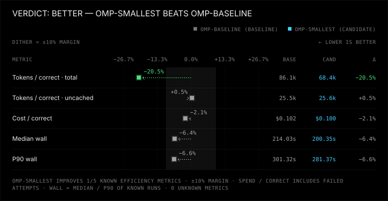
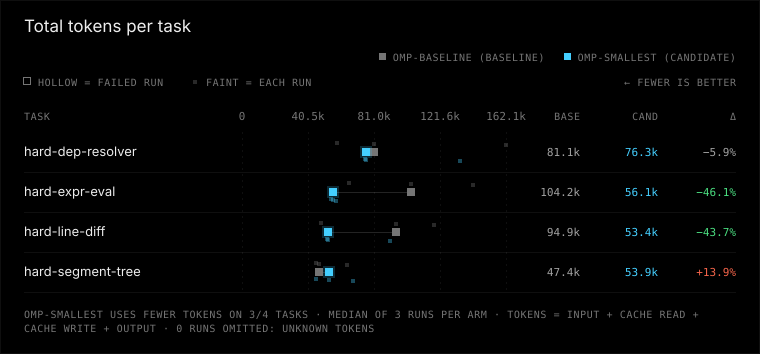
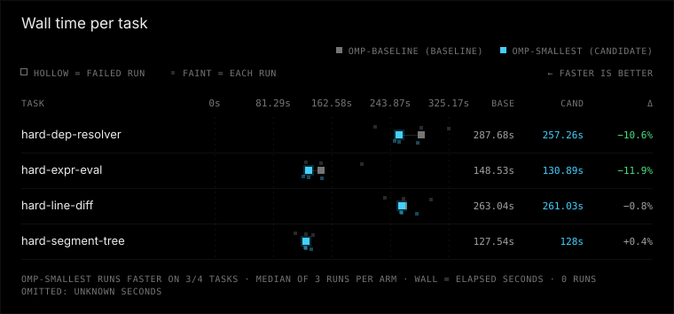

# omp-smallest vs omp-baseline

Verdict: better (omp-smallest vs baseline omp-baseline, margin 10%, min trials 3)

**Winner: omp-smallest (candidate). Compared with omp-baseline (baseline) it uses fewer tokens; correctness, time and safety are the same.**

| Dimension | omp-smallest vs omp-baseline | omp-baseline (baseline) | omp-smallest (candidate) |
|---|---|---|---|
| correctness | same | 12/12 passed, 0 regression runs, 0 unfinished | 12/12 passed, 0 regression runs, 0 unfinished |
| tokens | better | 86107 total / 25478 uncached per correct, 0 aux calls | 68431 total / 25604 uncached per correct, 0 aux calls |
| time | same | median 214.0 s, p90 301.3 s | median 200.3 s, p90 281.4 s |
| safety | same | 0 timeouts, 0 tampered, verification 12/12 | 0 timeouts, 0 tampered, verification 12/12 |

## Charts





## Per-task results

| Task | Arm | Passed/runs | Median wall s | Median total tokens | Median uncached tokens |
|---|---|---:|---:|---:|---:|
| hard-dep-resolver | omp-baseline | 3/3 | 287.7 | 81149 | 30227 |
| hard-dep-resolver | omp-smallest | 3/3 | 257.3 | 76335 | 33583 |
| hard-expr-eval | omp-baseline | 3/3 | 148.5 | 104172 | 18924 |
| hard-expr-eval | omp-smallest | 3/3 | 130.9 | 56106 | 22570 |
| hard-line-diff | omp-baseline | 3/3 | 263.0 | 94867 | 35731 |
| hard-line-diff | omp-smallest | 3/3 | 261.0 | 53383 | 27015 |
| hard-segment-tree | omp-baseline | 3/3 | 127.5 | 47350 | 17014 |
| hard-segment-tree | omp-smallest | 3/3 | 128.0 | 53943 | 17915 |

## Setup

### Invocation 2026-09-30T21:55:37.757622+00:00

- Config: benchmark-omp-smallest-useful-thing.toml
- Trials/jobs: 3/8
- Alternate order: False; timeout: None
- Platform: Windows-11-10.0.26200-SP0
- Python: 3.14.3; Node: v22.20.0
- omp-baseline: kind omp, version v18.4.5-0-g79808c3bf, config hash b586f5dd36ebb68f720129d1cfc95e59343bd35bff881ddf763c6027ed958c17, state isolated from experiments/omp-isolated/agent
- omp-smallest: kind omp, version v18.4.5-1-g27cdf191b, config hash c011a4c2b093a86029dce073b515f85880bdb7749a5404a248fd2410d05288ae, state isolated from experiments/omp-isolated/agent

Command template argv difference (differing elements only):
```json
{
  "omp-baseline": [
    "~/Desktop/omp-baseline/packages/coding-agent/src/cli.ts"
  ],
  "omp-smallest": [
    "~/Desktop/oh-my-pi/packages/coding-agent/src/cli.ts"
  ]
}
```

Task ids and hashes:
- hard-dep-resolver: c5041eab8ad4
- hard-expr-eval: 7e651a4872ef
- hard-line-diff: d140d53f0099
- hard-segment-tree: 51474f0d7d5a


## Warnings

- harness versions differ: v18.4.5-0-g79808c3bf vs v18.4.5-1-g27cdf191b
- correctness at ceiling: every run passed, so these tasks cannot distinguish correctness

## Reproduce

```console
python -m bench --config benchmark-omp-smallest-useful-thing.toml --results results/omp-smallest-useful-thing-repeat-3-2026-10-rerun run --harness omp-baseline omp-smallest --trials 3 --jobs 8 --task hard-dep-resolver hard-expr-eval hard-line-diff hard-segment-tree
python -m bench --config benchmark-omp-smallest-useful-thing.toml --results published/omp-smallest-useful-thing-repeat-3-2026-10 compare --baseline omp-baseline --candidate omp-smallest --margin 0.1 --min-trials 3 --format markdown
```

Run from the benchmark directory with the recorded config and tasks. The first command collects new trials in a fresh directory (compare it by pointing --results there); the second re-scores the runs in this report, and works on an exported bundle without model access.

## How to read this

Correctness and safety require non-inferiority (no extra failures or safety regressions). Tokens and time use a 10% relative margin. Unknown ≠ 0; medians use known runs only. Tokens per correct solution include failed attempts.
