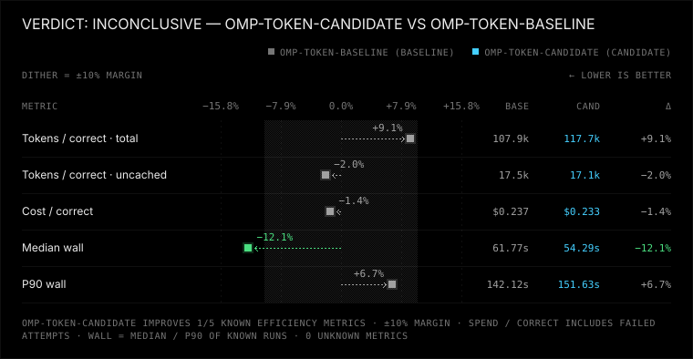
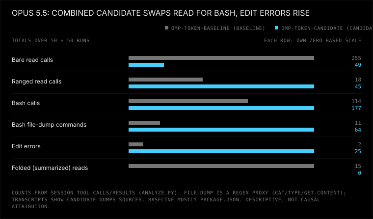

# OMP combined token reductions on Opus 5.5: inconclusive

[Measured report and charts](REPORT.md) · [Paired readable/raw transcripts](SESSIONS.md) · [Offline explorer](EXPLORER.html) · [Mechanism records](mechanisms.jsonl)

All **100 attempts passed**, 50/50 per arm across 10 tasks × 5 trials. No attempts were retried or excluded, and there were no timeouts, tampering, missing metrics or infrastructure failures. Correctness is at ceiling on this grid, so it says nothing about correctness superiority.

This is the [Sol integrated bundle](../omp-token-reductions-2026-10/README.md) rerun with only the model changed to `anthropic/claude-opus-5-5`. It combines inline tool descriptors, the 300-line read threshold, lean bash/edit payloads and proportional-verification wording. Opus was chosen because inline descriptors alone measured a large Opus token win on installed OMP 18.4.6 ([data](../omp-inline-descriptors-opus-2026-10/README.md)).

## Measured effects

| Metric | Baseline | Candidate | Qualification |
| --- | ---: | ---: | --- |
| Total tokens/correct | 107,875 | 117,734 | +9.1% point estimate; candidate/baseline 95% CI 0.95–1.26 |
| Uncached tokens/correct | 17,451 | 17,100 | −2.0% point estimate; 95% CI 0.90–1.06 |
| Median wall time | 61.8 s | 54.3 s | Ratio 0.88, 95% CI 0.70–1.15 |
| P90 wall time | 142.1 s | 151.6 s | Ratio 1.07, 95% CI 0.66–1.27 |
| Check after final edit | 41/50 | 49/50 | Recorded lifecycle proxy, not proof of correctness |

**The verdict is inconclusive:** the total-token interval cannot rule out the candidate being more than 10% worse, and neither latency interval is tight enough. The report's automatic "safety: better" label reflects only the verification proxy above.

## Mechanisms: Opus switches from `read` to bash dumps

These are descriptive totals from [mechanisms.jsonl](mechanisms.jsonl), not causal attribution:

| Observation | Baseline | Candidate |
| --- | ---: | ---: |
| Mean initial input tokens incl. cache | 6,903.1 | 7,164.7 (+3.8%) |
| Requests | 356 | 385 |
| Bare / ranged read calls | 255 / 18 | 49 / 45 |
| Folded reads | 15 | 0 |
| Read output characters | 385,923 | 189,774 |
| Bash calls | 114 | 177 |
| Bash file-dump commands (runs with any) | 11 (11) | 64 (49) |
| Edit errors (runs with any) | 2 (1) | 25 (21) |
| Cache read / cache write tokens | 4,521,182 / 542,265 | 5,031,695 / 535,078 |

In 49 of 50 candidate runs, Opus starts by dumping sources through bash, for example `ls -R src test; cat package.json src/*.js test/*`. Baseline `cat` use is almost always just `package.json`. Files read through bash have no snapshot tag, so first edits get rejected:

- 17 × `hash #0000 is not from this session`
- 3 × invented header tags such as `[src/rounding.js#R1]`
- 5 × anchors on lines the snapshot never displayed

Each rejection costs another request over a growing cached prefix. That matches the rise in cache-read tokens while uncached tokens stay flat. Examples: [bugfix-invoice trial 2](runs/omp-token-candidate/bugfix-invoice/trial-2/session.jsonl) ([timeline](EXPLORER.html#run=19)) and [hard-line-diff trial 1](runs/omp-token-candidate/hard-line-diff/trial-1/session.jsonl) ([timeline](EXPLORER.html#run=22)).

The file-dump count is a regex proxy (`cat`/`type`/`Get-Content`/`readFile`); the transcripts were inspected to confirm what it matches.

## Setup and attribution

Both arms ran from source at OMP 18.4.5 with Bun 1.3.14, `anthropic/claude-opus-5-5`, high thinking, isolated state, a pinned per-arm system-prompt template, tools read/bash/edit/write, AST edit off, and no prewalk, extensions, skills or rules. Baseline: `27cdf191bab644f78f1d680eb4ef6ce8002d6afc`, inline off, threshold 100. Candidate: [a05f8a3](https://github.com/NaC-L/oh-my-pi/commit/a05f8a3bb405928feff7df20bc923050017fba1f), inline on, threshold 300. All 21 frozen candidate files matched provenance before the grid. Eight concurrent workers took about 16.5 minutes, so latency includes shared provider load.

The bundle cannot attribute the bash habit to one change. It also differs from the inline-only Opus run in several ways: source build, pinned template, the new one-line schema summaries (`*-summary.md`), payloads, threshold and verification wording. The leading hypothesis is that the short schema summaries (bash: "Run commands in a persistent shell.") displace the native read-over-cat guidance. The next discriminating arm is the baseline source with only `inlineToolDescriptors: "on"`.

**Follow-up (2026-10-02): that hypothesis was falsified.** A screen ([protocol and data](../../experiments/omp-ultra/PLAN.md)) found inline descriptors alone on the unchanged baseline source dump 10/10, and the bundle without wire summaries still dumps 9/10. Installed OMP builds show the same habit in *both* arms of the earlier inline-only Opus run (24/24 each), so the bash dump is Opus's default on OMP and this bundle's inline-off baseline is the outlier. The dumps batch orientation (`cat src/*.js test/*`), which `read` could not serve: it rejected globs and did not document `;` lists.

Earlier launches stopped by the agent tool's 300 s command cap (30 passing attempts, plus five relaunches killed within seconds) and the preflight pair remain unpublished local exploratory data. They are not pooled here. Protocol: [experiments/omp-token-reductions-opus/PLAN.md](../../experiments/omp-token-reductions-opus/PLAN.md).

## Inspect all attempts

[SESSIONS.md](SESSIONS.md) pairs the same task/trial across arms. **Readable** links open the offline explorer's role/tool timeline at that run; **raw** links keep the sanitized native `session.jsonl`. Each run also keeps `stdout.jsonl`, stderr, patch and checks under `runs/<arm>/<task>/trial-N`. Open [EXPLORER.html](EXPLORER.html) locally to filter all 100 runs. [REPORT.md](REPORT.md) embeds the three comparison charts and the method; [runs.jsonl](runs.jsonl) and [manifest.json](manifest.json) keep portable metrics and setup. Local benchmark, home and temporary-directory roots are sanitized; raw results are unchanged.
