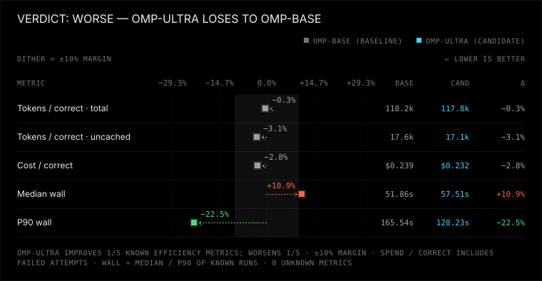
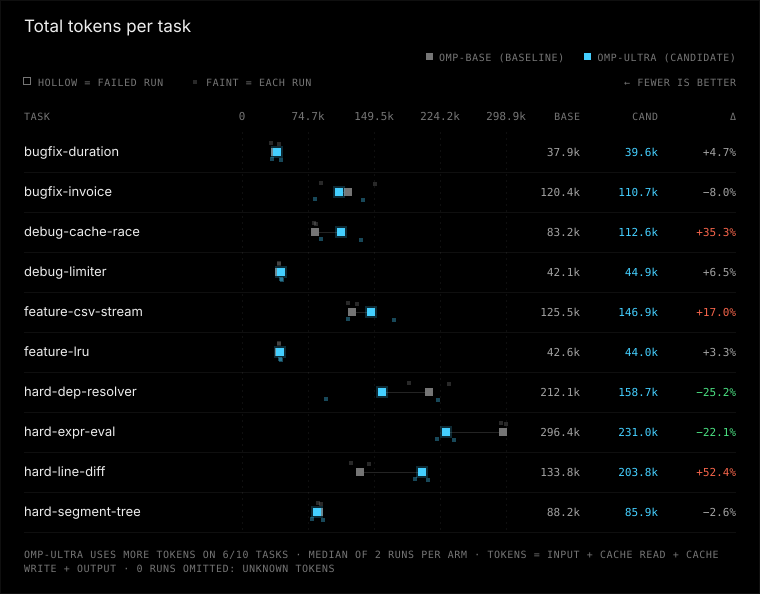
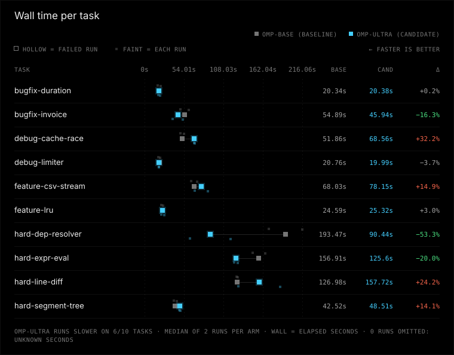

# omp-ultra vs omp-base

Verdict: worse (omp-ultra vs baseline omp-base, margin 10%, min trials 2)

**Winner: omp-base (baseline). omp-ultra (candidate) is less safe.**

| Dimension | omp-ultra vs omp-base | omp-base (baseline) | omp-ultra (candidate) |
|---|---|---|---|
| correctness | same | 20/20 passed, 0 regression runs, 0 unfinished | 20/20 passed, 0 regression runs, 0 unfinished |
| tokens | uncertain | 118230 total / 17598 uncached per correct, 0 aux calls | 117827 total / 17056 uncached per correct, 0 aux calls |
| time | uncertain | median 51.9 s, p90 165.5 s | median 57.5 s, p90 128.2 s |
| safety | worse | 0 timeouts, 0 tampered, verification 17/20 | 0 timeouts, 0 tampered, verification 16/20 |

## Efficiency ratios

Candidate/baseline, 95% bootstrap CI from 2000 resamples of runs within each task:

- total tokens per correct: ×1.00 (95% CI 0.90–1.11)
- uncached tokens per correct: ×0.97 (95% CI 0.89–1.05)
- median wall time: ×1.11 (95% CI 0.97–1.23)
- p90 wall time: ×0.77 (95% CI 0.74–0.86)

## Run classifications

| Arm | Success | Solution failure | Infrastructure failure | Unknown |
|---|---:|---:|---:|---:|
| omp-base | 20 | 0 | 0 | 0 |
| omp-ultra | 20 | 0 | 0 | 0 |

## Charts





## Per-task results

| Task | Arm | Passed/runs | Median wall s | Median total tokens | Median uncached tokens |
|---|---|---:|---:|---:|---:|
| bugfix-duration | omp-base | 2/2 | 20.3 | 37862 | 4308 |
| bugfix-duration | omp-ultra | 2/2 | 20.4 | 39642 | 4407 |
| bugfix-invoice | omp-base | 2/2 | 54.9 | 120408 | 19998 |
| bugfix-invoice | omp-ultra | 2/2 | 45.9 | 110720 | 15680 |
| debug-cache-race | omp-base | 2/2 | 51.9 | 83198 | 12648 |
| debug-cache-race | omp-ultra | 2/2 | 68.6 | 112607 | 15239 |
| debug-limiter | omp-base | 2/2 | 20.8 | 42106 | 4272 |
| debug-limiter | omp-ultra | 2/2 | 20.0 | 44857 | 4540 |
| feature-csv-stream | omp-base | 2/2 | 68.0 | 125549 | 18328 |
| feature-csv-stream | omp-ultra | 2/2 | 78.1 | 146919 | 20902 |
| feature-lru | omp-base | 2/2 | 24.6 | 42647 | 5318 |
| feature-lru | omp-ultra | 2/2 | 25.3 | 44046 | 4919 |
| hard-dep-resolver | omp-base | 2/2 | 193.5 | 212112 | 28786 |
| hard-dep-resolver | omp-ultra | 2/2 | 90.4 | 158702 | 21866 |
| hard-expr-eval | omp-base | 2/2 | 156.9 | 296414 | 40648 |
| hard-expr-eval | omp-ultra | 2/2 | 125.6 | 231049 | 33022 |
| hard-line-diff | omp-base | 2/2 | 127.0 | 133761 | 29555 |
| hard-line-diff | omp-ultra | 2/2 | 157.7 | 203818 | 37164 |
| hard-segment-tree | omp-base | 2/2 | 42.5 | 88240 | 12119 |
| hard-segment-tree | omp-ultra | 2/2 | 48.5 | 85908 | 12822 |

Per-task scorecards (all attempts retained):

| Task | Arm | Passed/runs | Total tokens/correct | Uncached tokens/correct | Median wall s | P90 wall s | Success / solution failure / infrastructure failure / unknown |
|---|---|---:|---:|---:|---:|---:|---|
| bugfix-duration | omp-base | 2/2 | 37862 | 4308 | 20.3 | 22.1 | 2 / 0 / 0 / 0 |
| bugfix-duration | omp-ultra | 2/2 | 39642 | 4407 | 20.4 | 21.4 | 2 / 0 / 0 / 0 |
| bugfix-invoice | omp-base | 2/2 | 120408 | 19998 | 54.9 | 60.6 | 2 / 0 / 0 / 0 |
| bugfix-invoice | omp-ultra | 2/2 | 110720 | 15680 | 45.9 | 52.6 | 2 / 0 / 0 / 0 |
| debug-cache-race | omp-base | 2/2 | 83198 | 12648 | 51.9 | 54.2 | 2 / 0 / 0 / 0 |
| debug-cache-race | omp-ultra | 2/2 | 112607 | 15239 | 68.6 | 68.8 | 2 / 0 / 0 / 0 |
| debug-limiter | omp-base | 2/2 | 42106 | 4272 | 20.8 | 22.0 | 2 / 0 / 0 / 0 |
| debug-limiter | omp-ultra | 2/2 | 44857 | 4540 | 20.0 | 20.2 | 2 / 0 / 0 / 0 |
| feature-csv-stream | omp-base | 2/2 | 125549 | 18328 | 68.0 | 72.1 | 2 / 0 / 0 / 0 |
| feature-csv-stream | omp-ultra | 2/2 | 146919 | 20902 | 78.1 | 87.2 | 2 / 0 / 0 / 0 |
| feature-lru | omp-base | 2/2 | 42647 | 5318 | 24.6 | 25.6 | 2 / 0 / 0 / 0 |
| feature-lru | omp-ultra | 2/2 | 44046 | 4919 | 25.3 | 27.5 | 2 / 0 / 0 / 0 |
| hard-dep-resolver | omp-base | 2/2 | 212112 | 28786 | 193.5 | 216.1 | 2 / 0 / 0 / 0 |
| hard-dep-resolver | omp-ultra | 2/2 | 158702 | 21866 | 90.4 | 118.5 | 2 / 0 / 0 / 0 |
| hard-expr-eval | omp-base | 2/2 | 296414 | 40648 | 156.9 | 165.5 | 2 / 0 / 0 / 0 |
| hard-expr-eval | omp-ultra | 2/2 | 231049 | 33022 | 125.6 | 128.2 | 2 / 0 / 0 / 0 |
| hard-line-diff | omp-base | 2/2 | 133761 | 29555 | 127.0 | 127.9 | 2 / 0 / 0 / 0 |
| hard-line-diff | omp-ultra | 2/2 | 203818 | 37164 | 157.7 | 186.3 | 2 / 0 / 0 / 0 |
| hard-segment-tree | omp-base | 2/2 | 88240 | 12119 | 42.5 | 44.5 | 2 / 0 / 0 / 0 |
| hard-segment-tree | omp-ultra | 2/2 | 85908 | 12822 | 48.5 | 49.2 | 2 / 0 / 0 / 0 |

Per-task point effects (descriptive only; no per-task winner or confidence claim):

| Task | Pass-rate difference (candidate - baseline, pp) | Total tokens/correct ratio | Uncached tokens/correct ratio | Median wall ratio | P90 wall ratio |
|---|---:|---:|---:|---:|---:|
| bugfix-duration | +0.0 | 1.05 | 1.02 | 1.00 | 0.97 |
| bugfix-invoice | +0.0 | 0.92 | 0.78 | 0.84 | 0.87 |
| debug-cache-race | +0.0 | 1.35 | 1.20 | 1.32 | 1.27 |
| debug-limiter | +0.0 | 1.07 | 1.06 | 0.96 | 0.92 |
| feature-csv-stream | +0.0 | 1.17 | 1.14 | 1.15 | 1.21 |
| feature-lru | +0.0 | 1.03 | 0.93 | 1.03 | 1.07 |
| hard-dep-resolver | +0.0 | 0.75 | 0.76 | 0.47 | 0.55 |
| hard-expr-eval | +0.0 | 0.78 | 0.81 | 0.80 | 0.77 |
| hard-line-diff | +0.0 | 1.52 | 1.26 | 1.24 | 1.46 |
| hard-segment-tree | +0.0 | 0.97 | 1.06 | 1.14 | 1.11 |

## Setup

### Invocation 2026-10-01T23:41:24.799040+00:00

- Config: benchmark-omp-ultra.toml
- Trials/jobs: 2/1
- Alternate order: True; timeout: None
- Platform: Windows-11-10.0.26200-SP0
- Python: 3.14.3; Node: v22.20.0
- omp-base: kind omp, version omp/18.4.5, config hash be423d3de04d16527ff49ee6e7b45b2132058d375ffe22a93bb819a58388eafe, state isolated from experiments/omp-isolated/agent
- omp-ultra: kind omp, version omp/18.4.5, config hash 942b27666f6e80601f880474ea18ac9d0ef70e5e56058ecdb7866561b4628166, state isolated from experiments/omp-isolated/agent

Command template argv difference (differing elements only):
```json
{
  "omp-base": [
    "{benchmark_dir}/../omp-token-baseline/packages/coding-agent/src/cli.ts"
  ],
  "omp-ultra": [
    "{benchmark_dir}/../omp-ultra/packages/coding-agent/src/cli.ts"
  ]
}
```
```json
{
  "omp-base": [
    "{benchmark_dir}/../omp-token-baseline/packages/coding-agent/src/prompts/system/system-prompt.md"
  ],
  "omp-ultra": [
    "{benchmark_dir}/../omp-ultra/packages/coding-agent/src/prompts/system/system-prompt.md"
  ]
}
```
```json
{
  "omp-base": [
    "{benchmark_dir}/experiments/omp-token-reductions/baseline.yml"
  ],
  "omp-ultra": [
    "{benchmark_dir}/experiments/omp-token-reductions/candidate.yml"
  ]
}
```

Overlay omp-base: experiments/omp-token-reductions/baseline.yml (sha256 487fef3ed87d9596d46d8daa8f058a1a39b7daf419ec2526232a0400bdf9aa28)
```
inlineToolDescriptors: "off"
textVerbosity: "medium"
tools:
  intentTracing: true
read:
  summarize:
    enabled: true
    minTotalLines: 100
astEdit:
  enabled: false

```

Overlay omp-ultra: experiments/omp-token-reductions/candidate.yml (sha256 9c4ec3e34edf1673005c7dec5ebbb352ebef7a985c853b44c25ea203ad989179)
```
inlineToolDescriptors: "on"
textVerbosity: "medium"
tools:
  intentTracing: true
read:
  summarize:
    enabled: true
    minTotalLines: 300
astEdit:
  enabled: false

```

Task ids and hashes:
- bugfix-duration: 501745f75d45
- bugfix-invoice: 9adc9ee1f0fe
- debug-cache-race: 223c66c5d3ac
- debug-limiter: 1d2a7f085811
- feature-csv-stream: 4f8c748564da
- feature-lru: 7d8ff3b71568
- hard-dep-resolver: c5041eab8ad4
- hard-expr-eval: 7e651a4872ef
- hard-line-diff: d140d53f0099
- hard-segment-tree: 51474f0d7d5a


## Warnings

- correctness at ceiling: every run passed, so these tasks cannot distinguish correctness

## Reproduce

```console
python -m bench --config benchmark-omp-ultra.toml --results results/omp-ultra-latency-2026-10-rerun run --harness omp-base omp-ultra --trials 2 --jobs 1 --task bugfix-duration bugfix-invoice debug-cache-race debug-limiter feature-csv-stream feature-lru hard-dep-resolver hard-expr-eval hard-line-diff hard-segment-tree --alternate-order
python -m bench --config benchmark-omp-ultra.toml --results published/omp-ultra-latency-2026-10 compare --baseline omp-base --candidate omp-ultra --margin 0.1 --min-trials 2 --format markdown
```

Run from the benchmark directory with the recorded config and tasks. The first command collects new trials in a fresh directory (compare it by pointing --results there); the second re-scores the runs in this report, and works on an exported bundle without model access.

## How to read this

Correctness and safety require non-inferiority (no extra failures or safety regressions). Tokens and time compare the 95% bootstrap interval of the candidate/baseline ratio with the 10% margin: worse if the whole interval is above it, better if an interval is wholly below it and no loss beyond it is possible, the same if it lies inside the band; otherwise the verdict is inconclusive. Infrastructure contamination makes a comparison inconclusive unless correctness or safety is measurably worse. Run classifications use explicit recorded evidence; missing legacy evidence is unknown, not infrastructure. Unknown ≠ 0; medians use known runs only. Tokens per correct solution include failed attempts. Per-task ratios and pass-rate differences are descriptive point effects, not per-task winners; aggregate bootstrap resampling is unchanged.
