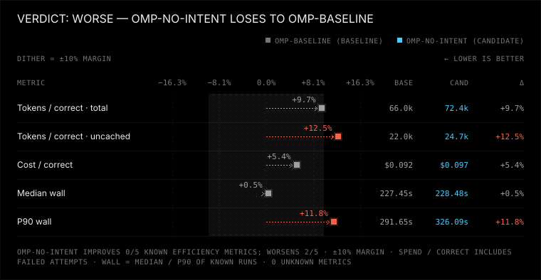
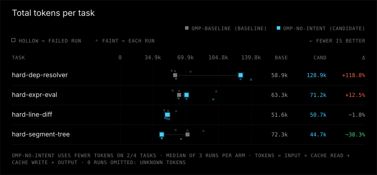
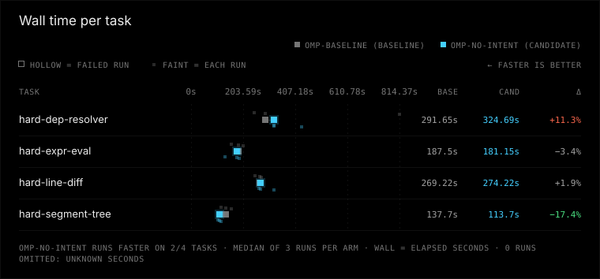

# omp-no-intent vs omp-baseline

Verdict: worse (omp-no-intent vs baseline omp-baseline, margin 10%, min trials 3)

**Winner: omp-baseline (baseline). omp-no-intent (candidate) uses more tokens and runs slower.**

| Dimension | omp-no-intent vs omp-baseline | omp-baseline (baseline) | omp-no-intent (candidate) |
|---|---|---|---|
| correctness | same | 12/12 passed, 0 regression runs, 0 unfinished | 12/12 passed, 0 regression runs, 0 unfinished |
| tokens | worse | 66037 total / 21994 uncached per correct, 0 aux calls | 72427 total / 24747 uncached per correct, 0 aux calls |
| time | worse | median 227.5 s, p90 291.7 s | median 228.5 s, p90 326.1 s |
| safety | same | 0 timeouts, 0 tampered, verification 12/12 | 0 timeouts, 0 tampered, verification 12/12 |

## Charts





## Per-task results

| Task | Arm | Passed/runs | Median wall s | Median total tokens | Median uncached tokens |
|---|---|---:|---:|---:|---:|
| hard-dep-resolver | omp-baseline | 3/3 | 291.7 | 58907 | 32718 |
| hard-dep-resolver | omp-no-intent | 3/3 | 324.7 | 128904 | 29561 |
| hard-expr-eval | omp-baseline | 3/3 | 187.5 | 63303 | 17479 |
| hard-expr-eval | omp-no-intent | 3/3 | 181.2 | 71202 | 31650 |
| hard-line-diff | omp-baseline | 3/3 | 269.2 | 51614 | 21219 |
| hard-line-diff | omp-no-intent | 3/3 | 274.2 | 50683 | 23419 |
| hard-segment-tree | omp-baseline | 3/3 | 137.7 | 72338 | 17482 |
| hard-segment-tree | omp-no-intent | 3/3 | 113.7 | 44659 | 15653 |

## Setup

### Invocation 2026-09-30T20:06:25.403860+00:00

- Config: benchmark-omp-verbosity-intent.toml
- Trials/jobs: 3/1
- Alternate order: False; timeout: None
- Platform: Windows-11-10.0.26200-SP0
- Python: 3.14.3; Node: v22.20.0
- omp-baseline: kind omp, version omp/18.4.4, config hash 33ee1313017e5035c3a6077c81cee0ea88ad56e22afc675571a036752a685106, state isolated from experiments/omp-isolated/agent

Task ids and hashes:
- hard-dep-resolver: c5041eab8ad4
- hard-expr-eval: 7e651a4872ef
- hard-line-diff: d140d53f0099
- hard-segment-tree: 51474f0d7d5a

### Invocation 2026-09-30T20:06:25.527735+00:00

- Config: benchmark-omp-verbosity-intent.toml
- Trials/jobs: 3/1
- Alternate order: False; timeout: None
- Platform: Windows-11-10.0.26200-SP0
- Python: 3.14.3; Node: v22.20.0
- omp-no-intent: kind omp, version omp/18.4.4, config hash 0f255aeb4fdd421f67648a5b54d19a9f6910744720791c21e68008518c4c024e, state isolated from experiments/omp-isolated/agent

Task ids and hashes:
- hard-dep-resolver: c5041eab8ad4
- hard-expr-eval: 7e651a4872ef
- hard-line-diff: d140d53f0099
- hard-segment-tree: 51474f0d7d5a


## Warnings

- correctness at ceiling: every run passed, so these tasks cannot distinguish correctness

## Reproduce

```console
python -m bench --config benchmark-omp-verbosity-intent.toml --results results/no-intent-rerun run --harness omp-baseline omp-no-intent --trials 3 --jobs 1 --task hard-dep-resolver hard-expr-eval hard-line-diff hard-segment-tree
python -m bench --config benchmark-omp-verbosity-intent.toml --results published/omp-verbosity-intent-2026-09/no-intent compare --baseline omp-baseline --candidate omp-no-intent --margin 0.1 --min-trials 3 --format markdown
```

Run from the benchmark directory with the recorded config and tasks. The first command collects new trials in a fresh directory (compare it by pointing --results there); the second re-scores the runs in this report, and works on an exported bundle without model access.

## How to read this

Correctness and safety require non-inferiority (no extra failures or safety regressions). Tokens and time use a 10% relative margin. Unknown ≠ 0; medians use known runs only. Tokens per correct solution include failed attempts.
