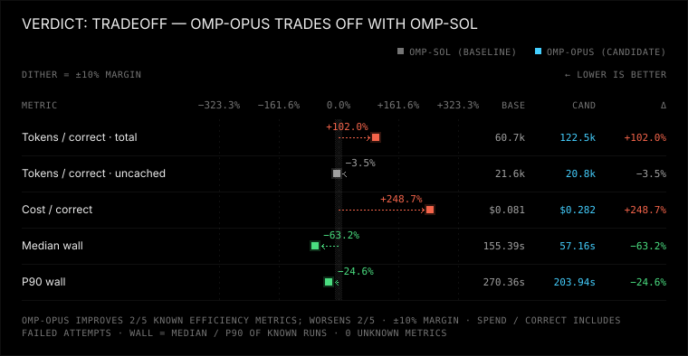
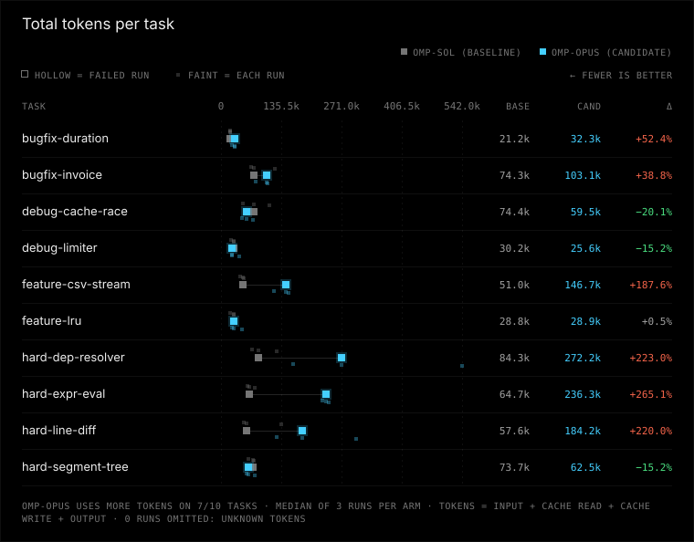
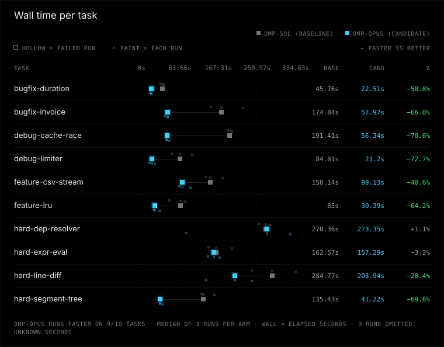

# omp-opus vs omp-sol

Verdict: tradeoff (omp-opus vs baseline omp-sol, margin 10%, min trials 3)

**No overall winner (tradeoff): omp-opus (candidate) runs faster but uses more tokens than omp-sol (baseline).**

| Dimension | omp-opus vs omp-sol | omp-sol (baseline) | omp-opus (candidate) |
|---|---|---|---|
| correctness | same | 30/30 passed, 0 regression runs, 0 unfinished | 30/30 passed, 0 regression runs, 0 unfinished |
| tokens | worse | 60650 total / 21550 uncached per correct, 0 aux calls | 122504 total / 20786 uncached per correct, 0 aux calls |
| time | better | median 155.4 s, p90 270.4 s | median 57.2 s, p90 203.9 s |
| safety | same | 0 timeouts, 0 tampered, verification 30/30 | 0 timeouts, 0 tampered, verification 30/30 |

## Efficiency ratios

Candidate/baseline, 95% bootstrap CI from 2000 resamples of runs within each task:

- total tokens per correct: ×2.02 (95% CI 1.66–2.42)
- uncached tokens per correct: ×0.96 (95% CI 0.85–1.09)
- median wall time: ×0.37 (95% CI 0.32–0.39)
- p90 wall time: ×0.75 (95% CI 0.54–0.93)

## Run classifications

| Arm | Success | Solution failure | Infrastructure failure | Unknown |
|---|---:|---:|---:|---:|
| omp-sol | 30 | 0 | 0 | 0 |
| omp-opus | 30 | 0 | 0 | 0 |

## Charts





## Per-task results

| Task | Arm | Passed/runs | Median wall s | Median total tokens | Median uncached tokens |
|---|---|---:|---:|---:|---:|
| bugfix-duration | omp-sol | 3/3 | 45.8 | 21205 | 10852 |
| bugfix-duration | omp-opus | 3/3 | 22.5 | 32319 | 4916 |
| bugfix-invoice | omp-sol | 3/3 | 174.8 | 74284 | 24465 |
| bugfix-invoice | omp-opus | 3/3 | 58.0 | 103110 | 18619 |
| debug-cache-race | omp-sol | 3/3 | 191.4 | 74426 | 23354 |
| debug-cache-race | omp-opus | 3/3 | 56.3 | 59501 | 12717 |
| debug-limiter | omp-sol | 3/3 | 84.8 | 30158 | 13185 |
| debug-limiter | omp-opus | 3/3 | 23.2 | 25582 | 4858 |
| feature-csv-stream | omp-sol | 3/3 | 150.1 | 51014 | 17734 |
| feature-csv-stream | omp-opus | 3/3 | 89.1 | 146737 | 21378 |
| feature-lru | omp-sol | 3/3 | 85.0 | 28794 | 15184 |
| feature-lru | omp-opus | 3/3 | 30.4 | 28938 | 6911 |
| hard-dep-resolver | omp-sol | 3/3 | 270.4 | 84285 | 34990 |
| hard-dep-resolver | omp-opus | 3/3 | 273.3 | 272250 | 36952 |
| hard-expr-eval | omp-sol | 3/3 | 162.6 | 64733 | 18471 |
| hard-expr-eval | omp-opus | 3/3 | 157.3 | 236310 | 38857 |
| hard-line-diff | omp-sol | 3/3 | 284.8 | 57568 | 29621 |
| hard-line-diff | omp-opus | 3/3 | 203.9 | 184239 | 51634 |
| hard-segment-tree | omp-sol | 3/3 | 135.4 | 73713 | 16623 |
| hard-segment-tree | omp-opus | 3/3 | 41.2 | 62519 | 11489 |

Per-task scorecards (all attempts retained):

| Task | Arm | Passed/runs | Total tokens/correct | Uncached tokens/correct | Median wall s | P90 wall s | Success / solution failure / infrastructure failure / unknown |
|---|---|---:|---:|---:|---:|---:|---|
| bugfix-duration | omp-sol | 3/3 | 21433 | 10596 | 45.8 | 48.8 | 3 / 0 / 0 / 0 |
| bugfix-duration | omp-opus | 3/3 | 30056 | 4914 | 22.5 | 22.8 | 3 / 0 / 0 / 0 |
| bugfix-invoice | omp-sol | 3/3 | 88473 | 31555 | 174.8 | 220.7 | 3 / 0 / 0 / 0 |
| bugfix-invoice | omp-opus | 3/3 | 95995 | 18417 | 58.0 | 58.0 | 3 / 0 / 0 / 0 |
| debug-cache-race | omp-sol | 3/3 | 78343 | 23687 | 191.4 | 197.3 | 3 / 0 / 0 / 0 |
| debug-cache-race | omp-opus | 3/3 | 60024 | 12797 | 56.3 | 61.3 | 3 / 0 / 0 / 0 |
| debug-limiter | omp-sol | 3/3 | 28174 | 11747 | 84.8 | 111.3 | 3 / 0 / 0 / 0 |
| debug-limiter | omp-opus | 3/3 | 30872 | 5202 | 23.2 | 30.4 | 3 / 0 / 0 / 0 |
| feature-csv-stream | omp-sol | 3/3 | 49461 | 19125 | 150.1 | 176.9 | 3 / 0 / 0 / 0 |
| feature-csv-stream | omp-opus | 3/3 | 139797 | 22887 | 89.1 | 106.5 | 3 / 0 / 0 / 0 |
| feature-lru | omp-sol | 3/3 | 26605 | 14360 | 85.0 | 95.6 | 3 / 0 / 0 / 0 |
| feature-lru | omp-opus | 3/3 | 34672 | 6704 | 30.4 | 40.1 | 3 / 0 / 0 / 0 |
| hard-dep-resolver | omp-sol | 3/3 | 94197 | 35957 | 270.4 | 279.3 | 3 / 0 / 0 / 0 |
| hard-dep-resolver | omp-opus | 3/3 | 325896 | 40238 | 273.3 | 324.3 | 3 / 0 / 0 / 0 |
| hard-expr-eval | omp-sol | 3/3 | 67250 | 20957 | 162.6 | 197.1 | 3 / 0 / 0 / 0 |
| hard-expr-eval | omp-opus | 3/3 | 236061 | 38063 | 157.3 | 170.1 | 3 / 0 / 0 / 0 |
| hard-line-diff | omp-sol | 3/3 | 82452 | 27668 | 284.8 | 334.6 | 3 / 0 / 0 / 0 |
| hard-line-diff | omp-opus | 3/3 | 205527 | 46581 | 203.9 | 239.9 | 3 / 0 / 0 / 0 |
| hard-segment-tree | omp-sol | 3/3 | 70113 | 19852 | 135.4 | 159.0 | 3 / 0 / 0 / 0 |
| hard-segment-tree | omp-opus | 3/3 | 66138 | 12057 | 41.2 | 46.6 | 3 / 0 / 0 / 0 |

Per-task point effects (descriptive only; no per-task winner or confidence claim):

| Task | Pass-rate difference (candidate − baseline, pp) | Total tokens/correct ratio | Uncached tokens/correct ratio | Median wall ratio | P90 wall ratio |
|---|---:|---:|---:|---:|---:|
| bugfix-duration | +0.0 | 1.40 | 0.46 | 0.49 | 0.47 |
| bugfix-invoice | +0.0 | 1.09 | 0.58 | 0.33 | 0.26 |
| debug-cache-race | +0.0 | 0.77 | 0.54 | 0.29 | 0.31 |
| debug-limiter | +0.0 | 1.10 | 0.44 | 0.27 | 0.27 |
| feature-csv-stream | +0.0 | 2.83 | 1.20 | 0.59 | 0.60 |
| feature-lru | +0.0 | 1.30 | 0.47 | 0.36 | 0.42 |
| hard-dep-resolver | +0.0 | 3.46 | 1.12 | 1.01 | 1.16 |
| hard-expr-eval | +0.0 | 3.51 | 1.82 | 0.97 | 0.86 |
| hard-line-diff | +0.0 | 2.49 | 1.68 | 0.72 | 0.72 |
| hard-segment-tree | +0.0 | 0.94 | 0.61 | 0.30 | 0.29 |

## Setup

### Invocation 2026-10-01T07:09:35.547489+00:00

- Config: benchmark-opus-vs-sol.toml
- Trials/jobs: 3/12
- Alternate order: False; timeout: None
- Platform: Windows-11-10.0.26200-SP0
- Python: 3.14.3; Node: v22.20.0
- omp-sol: kind omp, version omp/18.4.8, config hash 9d993f95f1a38ac9909217c57554864ff4a970a2575b5271f664cc20b9cb9ccb, state isolated from experiments/omp-isolated/agent
- omp-opus: kind omp, version omp/18.4.8, config hash b06e8f0f3a23f2f3b764727c79424747c0943affd2d2acc5d0f2c9cfc7284d52, state isolated from experiments/omp-isolated/agent

Command template argv difference (differing elements only):
```json
{
  "omp-sol": [
    "openai-codex/gpt-6.1-sol"
  ],
  "omp-opus": [
    "anthropic/claude-opus-5-5"
  ]
}
```

Task ids and hashes:
- bugfix-duration: 501745f75d45
- bugfix-invoice: 9adc9ee1f0fe
- debug-cache-race: 223c66c5d3ac
- debug-limiter: 1d2a7f085811
- feature-csv-stream: 4f8c748564da
- feature-lru: 7d8ff3b71568
- hard-dep-resolver: c5041eab8ad4
- hard-expr-eval: 7e651a4872ef
- hard-line-diff: d140d53f0099
- hard-segment-tree: 51474f0d7d5a


## Warnings

- correctness at ceiling: every run passed, so these tasks cannot distinguish correctness

## Reproduce

```console
python -m bench --config benchmark-opus-vs-sol.toml --results results/opus-vs-sol-2026-10-rerun run --harness omp-sol omp-opus --trials 3 --jobs 12 --task bugfix-duration bugfix-invoice debug-cache-race debug-limiter feature-csv-stream feature-lru hard-dep-resolver hard-expr-eval hard-line-diff hard-segment-tree
python -m bench --config benchmark-opus-vs-sol.toml --results published/opus-vs-sol-2026-10 compare --baseline omp-sol --candidate omp-opus --margin 0.1 --min-trials 3 --format markdown
```

Run from the benchmark directory with the recorded config and tasks. The first command collects new trials in a fresh directory (compare it by pointing --results there); the second re-scores the runs in this report, and works on an exported bundle without model access.

## How to read this

Correctness and safety require non-inferiority (no extra failures or safety regressions). Tokens and time compare the 95% bootstrap interval of the candidate/baseline ratio with the 10% margin: worse if the whole interval is above it, better if an interval is wholly below it and no loss beyond it is possible, the same if it lies inside the band; otherwise the verdict is inconclusive. Infrastructure contamination makes a comparison inconclusive unless correctness or safety is measurably worse. Run classifications use explicit recorded evidence; missing legacy evidence is unknown, not infrastructure. Unknown ≠ 0; medians use known runs only. Tokens per correct solution include failed attempts. Per-task ratios and pass-rate differences are descriptive point effects, not per-task winners; aggregate bootstrap resampling is unchanged.
