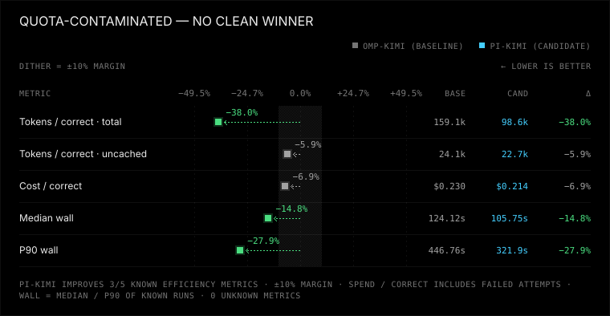
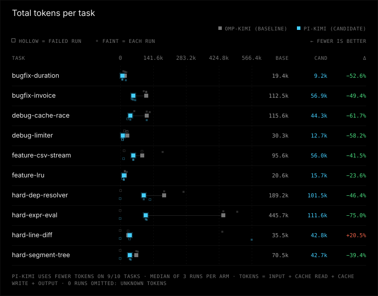
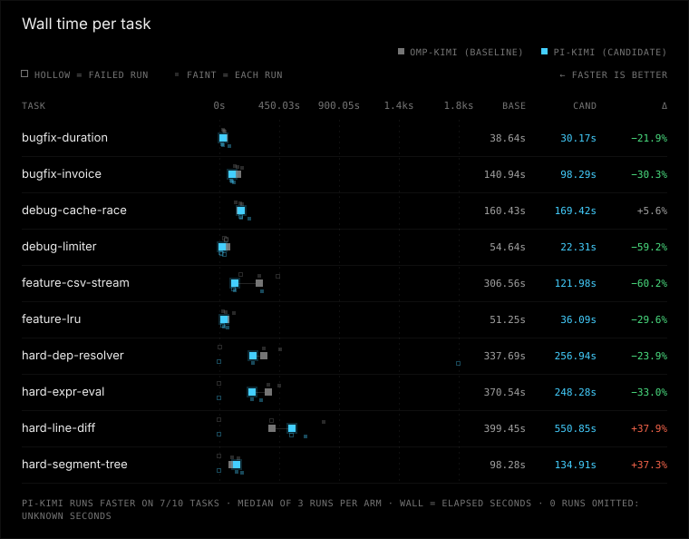

# pi-kimi vs omp-kimi

Outcome: **quota-contaminated; no clean harness winner established.**

The automatic scorer labels Pi “worse” and OMP the winner, but that label treats provider failures as solution failures. Do not interpret it as harness superiority.

This fresh 60-run batch used eight concurrent workers with no alternating order; partial serial and preflight runs are excluded. OMP passed 20/30 and Pi 18/30. Recorded failures: 14 Kimi HTTP 403 five-hour usage-limit rejections (OMP 6, Pi 8), one OMP HTTP 401 authentication rejection, one Pi dependency-resolver timeout at 1800.1 seconds, and six task-check failures (three per arm). No failed runs were discarded or retried. Latency includes concurrency and provider contention; token and time ratios below describe this contaminated batch, not an uncontaminated efficiency result.

| Dimension | pi-kimi vs omp-kimi | omp-kimi (baseline) | pi-kimi (candidate) |
|---|---|---|---|
| correctness | worse | 20/30 passed, 0 regression runs, 7 unfinished | 18/30 passed, 0 regression runs, 9 unfinished |
| tokens | uncertain | 159099 total / 24110 uncached per correct, 0 aux calls | 98576 total / 22686 uncached per correct, 0 aux calls |
| time | uncertain | median 124.1 s, p90 446.8 s | median 105.8 s, p90 321.9 s |
| safety | worse | 0 timeouts, 0 tampered, verification 23/26 | 1 timeouts, 0 tampered, verification 24/26 |

## Efficiency ratios

Candidate/baseline, 95% bootstrap CI from 2000 resamples of runs within each task:

- total tokens per correct: ×0.62 (95% CI 0.37–0.99)
- uncached tokens per correct: ×0.94 (95% CI 0.67–1.32)
- median wall time: ×0.85 (95% CI 0.46–1.80)
- p90 wall time: ×0.72 (95% CI 0.55–1.63)

## Run classifications

| Arm | Success | Solution failure | Infrastructure failure | Unknown |
|---|---:|---:|---:|---:|
| omp-kimi | 20 | 10 | 0 | 0 |
| pi-kimi | 18 | 12 | 0 | 0 |

## Charts





## Per-task results

| Task | Arm | Passed/runs | Median wall s | Median total tokens | Median uncached tokens |
|---|---|---:|---:|---:|---:|
| bugfix-duration | omp-kimi | 3/3 | 38.6 | 19428 | 3044 |
| bugfix-duration | pi-kimi | 3/3 | 30.2 | 9215 | 2248 |
| bugfix-invoice | omp-kimi | 3/3 | 140.9 | 112472 | 16996 |
| bugfix-invoice | pi-kimi | 3/3 | 98.3 | 56908 | 13420 |
| debug-cache-race | omp-kimi | 3/3 | 160.4 | 115601 | 17627 |
| debug-cache-race | pi-kimi | 2/3 | 169.4 | 44318 | 15134 |
| debug-limiter | omp-kimi | 0/3 | 54.6 | 30287 | 4388 |
| debug-limiter | pi-kimi | 0/3 | 22.3 | 12675 | 3081 |
| feature-csv-stream | omp-kimi | 1/3 | 306.6 | 95627 | 14731 |
| feature-csv-stream | pi-kimi | 2/3 | 122.0 | 55957 | 14418 |
| feature-lru | omp-kimi | 3/3 | 51.2 | 20569 | 4185 |
| feature-lru | pi-kimi | 2/3 | 36.1 | 15723 | 3899 |
| hard-dep-resolver | omp-kimi | 2/3 | 337.7 | 189178 | 33706 |
| hard-dep-resolver | pi-kimi | 1/3 | 256.9 | 101465 | 29785 |
| hard-expr-eval | omp-kimi | 2/3 | 370.5 | 445709 | 33037 |
| hard-expr-eval | pi-kimi | 2/3 | 248.3 | 111563 | 24638 |
| hard-line-diff | omp-kimi | 1/3 | 399.4 | 35501 | 26541 |
| hard-line-diff | pi-kimi | 1/3 | 550.8 | 42783 | 35871 |
| hard-segment-tree | omp-kimi | 2/3 | 98.3 | 70506 | 13418 |
| hard-segment-tree | pi-kimi | 2/3 | 134.9 | 42730 | 11169 |

Per-task scorecards (all attempts retained):

| Task | Arm | Passed/runs | Total tokens/correct | Uncached tokens/correct | Median wall s | P90 wall s | Success / solution failure / infrastructure failure / unknown |
|---|---|---:|---:|---:|---:|---:|---|
| bugfix-duration | omp-kimi | 3/3 | 20127 | 3402 | 38.6 | 41.8 | 3 / 0 / 0 / 0 |
| bugfix-duration | pi-kimi | 3/3 | 14001 | 3420 | 30.2 | 76.5 | 3 / 0 / 0 / 0 |
| bugfix-invoice | omp-kimi | 3/3 | 109353 | 18217 | 140.9 | 174.0 | 3 / 0 / 0 / 0 |
| bugfix-invoice | pi-kimi | 3/3 | 57723 | 13776 | 98.3 | 114.8 | 3 / 0 / 0 / 0 |
| debug-cache-race | omp-kimi | 3/3 | 101946 | 16527 | 160.4 | 176.1 | 3 / 0 / 0 / 0 |
| debug-cache-race | pi-kimi | 2/3 | 95882 | 22794 | 169.4 | 231.8 | 2 / 1 / 0 / 0 |
| debug-limiter | omp-kimi | 0/3 | unknown | unknown | 54.6 | 57.4 | 0 / 3 / 0 / 0 |
| debug-limiter | pi-kimi | 0/3 | unknown | unknown | 22.3 | 40.9 | 0 / 3 / 0 / 0 |
| feature-csv-stream | omp-kimi | 1/3 | 297668 | 48068 | 306.6 | 446.8 | 1 / 2 / 0 / 0 |
| feature-csv-stream | pi-kimi | 2/3 | 64300 | 21548 | 122.0 | 321.9 | 2 / 1 / 0 / 0 |
| feature-lru | omp-kimi | 3/3 | 23170 | 5336 | 51.2 | 113.9 | 3 / 0 / 0 / 0 |
| feature-lru | pi-kimi | 2/3 | 22637 | 5485 | 36.1 | 63.8 | 2 / 1 / 0 / 0 |
| hard-dep-resolver | omp-kimi | 2/3 | 232696 | 34808 | 337.7 | 457.9 | 2 / 1 / 0 / 0 |
| hard-dep-resolver | pi-kimi | 1/3 | 231379 | 63443 | 256.9 | 1800.1 | 1 / 2 / 0 / 0 |
| hard-expr-eval | omp-kimi | 2/3 | 475994 | 36186 | 370.5 | 455.0 | 2 / 1 / 0 / 0 |
| hard-expr-eval | pi-kimi | 2/3 | 112772 | 26116 | 248.3 | 314.2 | 2 / 1 / 0 / 0 |
| hard-line-diff | omp-kimi | 1/3 | 477121 | 122049 | 399.4 | 787.6 | 1 / 2 / 0 / 0 |
| hard-line-diff | pi-kimi | 1/3 | 609226 | 107978 | 550.8 | 650.4 | 1 / 2 / 0 / 0 |
| hard-segment-tree | omp-kimi | 2/3 | 72858 | 13722 | 98.3 | 144.7 | 2 / 1 / 0 / 0 |
| hard-segment-tree | pi-kimi | 2/3 | 44742 | 12102 | 134.9 | 172.5 | 2 / 1 / 0 / 0 |

Per-task point effects (descriptive only; no per-task winner or confidence claim):

| Task | Pass-rate difference (candidate - baseline, pp) | Total tokens/correct ratio | Uncached tokens/correct ratio | Median wall ratio | P90 wall ratio |
|---|---:|---:|---:|---:|---:|
| bugfix-duration | +0.0 | 0.70 | 1.01 | 0.78 | 1.83 |
| bugfix-invoice | +0.0 | 0.53 | 0.76 | 0.70 | 0.66 |
| debug-cache-race | -33.3 | 0.94 | 1.38 | 1.06 | 1.32 |
| debug-limiter | +0.0 | unknown | unknown | 0.41 | 0.71 |
| feature-csv-stream | +33.3 | 0.22 | 0.45 | 0.40 | 0.72 |
| feature-lru | -33.3 | 0.98 | 1.03 | 0.70 | 0.56 |
| hard-dep-resolver | -33.3 | 0.99 | 1.82 | 0.76 | 3.93 |
| hard-expr-eval | +0.0 | 0.24 | 0.72 | 0.67 | 0.69 |
| hard-line-diff | +0.0 | 1.28 | 0.88 | 1.38 | 0.83 |
| hard-segment-tree | +0.0 | 0.61 | 0.88 | 1.37 | 1.19 |

## Setup

### Invocation 2026-10-01T13:27:01.190039+00:00

- Config: benchmark-pi-omp-kimi.toml
- Trials/jobs: 3/8
- Alternate order: False; timeout: None
- Platform: Windows-11-10.0.26200-SP0
- Python: 3.14.3; Node: v22.20.0
- omp-kimi: kind omp, version omp/18.4.8, config hash 5e66a398ab527a0d9291d8bcf021832941807d53fe4a74f5f5373435911d9571, state isolated from experiments/pi-omp-kimi/omp
- pi-kimi: kind pi, version 0.99.1, config hash 70426fc7887a3b4fea16cad47f31cf8c1d4babcd86b16e4e13e8512aea5489a8, state isolated from experiments/omp-inline-codex-pi/pi

Command template argv difference (differing elements only):
```json
{
  "omp-kimi": [
    "omp"
  ],
  "pi-kimi": [
    "node",
    "{benchmark_dir}/.tools/pi/node_modules/@earendil-works/pi-coding-agent/dist/bundle/cli.js"
  ]
}
```
```json
{
  "omp-kimi": [
    "--no-title",
    "--config",
    "{benchmark_dir}/experiments/pi-omp-sol/omp.yml",
    "--no-prewalk"
  ],
  "pi-kimi": []
}
```
```json
{
  "omp-kimi": [
    "--no-rules"
  ],
  "pi-kimi": [
    "--no-prompt-templates",
    "--no-context-files"
  ]
}
```
```json
{
  "omp-kimi": [
    "kimi-code/k3"
  ],
  "pi-kimi": [
    "kimi-coding/k3"
  ]
}
```
```json
{
  "omp-kimi": [],
  "pi-kimi": [
    "--session-id",
    "{session_id}"
  ]
}
```

Overlay pi-kimi: .tools/pi/node_modules/@earendil-works/pi-coding-agent/dist/bundle/cli.js (sha256 e79626f2dd6f94aa45d30f3fa63cd84319a6eefcd150b353cfaf274366926774)
```
#!/usr/bin/env node
import { createRequire, enableCompileCache } from "node:module";

enableCompileCache();
createRequire(import.meta.url)("./cli-runtime.js");

```

Overlay pi-kimi: experiments/omp-inline-codex-pi/pi/settings.json (sha256 ca3d163bab055381827226140568f3bef7eaac187cebd76878e0b63e9e442356)
```
{}

```

Overlay omp-kimi: experiments/pi-omp-kimi/omp/config.yml (sha256 4ff0d63a3c0a4d8a968b8e20c889edf08140e796738543b85377d76e3a29a49d)
```
# Benchmark-owned state; all unspecified settings use OMP defaults.
memory:
  backend: "off"

```

Overlay omp-kimi: experiments/pi-omp-kimi/omp/models.yml (sha256 7ed25a3f5ceee346d1737e154962ef95079966d39a9186e911c7645b833bf5e8)
```
# Resolve the runner-exported credential; no secret is stored in this template.
providers:
  kimi-code:
    apiKey: KIMI_API_KEY

```

Overlay omp-kimi: experiments/pi-omp-sol/omp.yml (sha256 8f0758882fdc929d170bad036a9cb909d3d7cf8613e931349291534af12a83d8)
```
features:

  unexpectedStopDetection: off

advisor:

  enabled: false


```

Task ids and hashes:
- bugfix-duration: 501745f75d45
- bugfix-invoice: 9adc9ee1f0fe
- debug-cache-race: 223c66c5d3ac
- debug-limiter: 1d2a7f085811
- feature-csv-stream: 4f8c748564da
- feature-lru: 7d8ff3b71568
- hard-dep-resolver: c5041eab8ad4
- hard-expr-eval: 7e651a4872ef
- hard-line-diff: d140d53f0099
- hard-segment-tree: 51474f0d7d5a


## Warnings

- harness versions differ: omp/18.4.8 vs 0.99.1

## Reproduce

```console
python -m bench --config benchmark-pi-omp-kimi.toml --results results/pi-vs-omp-kimi-2026-10-rerun run --harness omp-kimi pi-kimi --trials 3 --jobs 8 --task bugfix-duration bugfix-invoice debug-cache-race debug-limiter feature-csv-stream feature-lru hard-dep-resolver hard-expr-eval hard-line-diff hard-segment-tree
python -m bench --config benchmark-pi-omp-kimi.toml --results published/pi-vs-omp-kimi-2026-10 compare --baseline omp-kimi --candidate pi-kimi --margin 0.1 --min-trials 3 --format markdown
```

Run from the benchmark directory with the recorded config and tasks. The first command collects new trials in a fresh directory (compare it by pointing --results there); the second re-scores the runs in this report, and works on an exported bundle without model access.

## How to read this

Correctness and safety require non-inferiority (no extra failures or safety regressions). Tokens and time compare the 95% bootstrap interval of the candidate/baseline ratio with the 10% margin: worse if the whole interval is above it, better if an interval is wholly below it and no loss beyond it is possible, the same if it lies inside the band; otherwise the verdict is inconclusive. Infrastructure contamination makes a comparison inconclusive unless correctness or safety is measurably worse. Run classifications use explicit recorded evidence; missing legacy evidence is unknown, not infrastructure. Unknown ≠ 0; medians use known runs only. Tokens per correct solution include failed attempts. Per-task ratios and pass-rate differences are descriptive point effects, not per-task winners; aggregate bootstrap resampling is unchanged.
