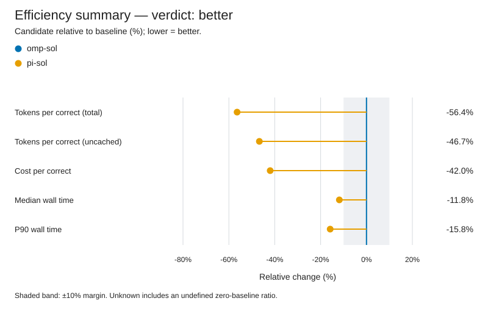
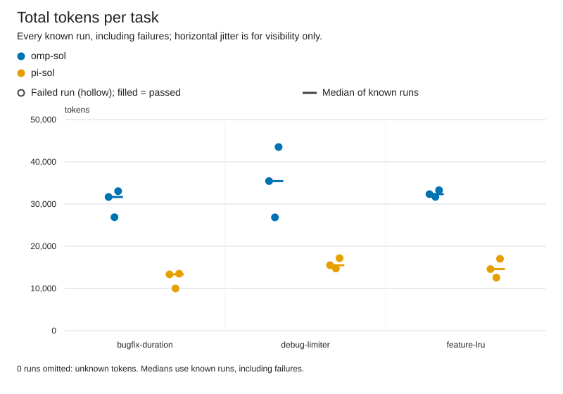
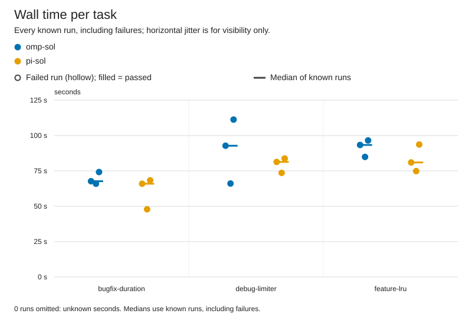

# pi-sol vs omp-sol

Verdict: better (pi-sol vs baseline omp-sol, margin 10%, min trials 3)

| Dimension | Result | Baseline | Candidate |
|---|---|---|---|
| correctness | same | 9/9 passed, 0 regression runs, 0 unfinished | 9/9 passed, 0 regression runs, 0 unfinished |
| tokens | better | 32744 total / 14341 uncached per correct, 0 aux calls | 14271 total / 7643 uncached per correct, 0 aux calls |
| time | better | median 84.9 s, p90 111.3 s | median 74.8 s, p90 93.7 s |
| safety | same | 0 timeouts, 0 tampered, verification 0/0 | 0 timeouts, 0 tampered, verification 0/0 |

## Charts





## Per-task results

| Task | Arm | Passed/runs | Median wall s | Median total tokens | Median uncached tokens |
|---|---|---:|---:|---:|---:|
| bugfix-duration | omp-sol | 3/3 | 67.7 | 31671 | 18201 |
| bugfix-duration | pi-sol | 3/3 | 65.9 | 13342 | 6686 |
| debug-limiter | omp-sol | 3/3 | 92.8 | 35436 | 11884 |
| debug-limiter | pi-sol | 3/3 | 81.3 | 15506 | 9754 |
| feature-lru | omp-sol | 3/3 | 93.3 | 32345 | 14155 |
| feature-lru | pi-sol | 3/3 | 81.0 | 14585 | 7686 |

## Setup

No manifest.json; setup not recorded.

## Warnings

- harness versions differ: omp/18.4.4 vs 0.99.1
- operator state not isolated for 18 runs: the harness may have read the operator's personal instructions, settings and MCP servers
- correctness at ceiling: every run passed, so these tasks cannot distinguish correctness
- regression data unknown for 18 runs; regression comparison skipped
- verification unknown; verification comparison skipped

## Reproduce

config path not recorded; replace CONFIG with the harness configuration.
```console
python -m bench --config CONFIG --results results/pi-vs-omp-sol-2026-09-rerun run --harness omp-sol pi-sol --trials 3 --jobs 1
python -m bench --config CONFIG --results published/pi-vs-omp-sol-2026-09 compare --baseline omp-sol --candidate pi-sol --margin 0.1 --min-trials 3 --format markdown
```

Run from the benchmark directory with the recorded config and tasks. The first command collects new trials in a fresh directory (compare it by pointing --results there); the second re-scores the runs in this report, and works on an exported bundle without model access.

## How to read this

Correctness and safety require non-inferiority (no extra failures or safety regressions). Tokens and time use a 10% relative margin. Unknown ≠ 0; medians use known runs only. Tokens per correct solution include failed attempts.
